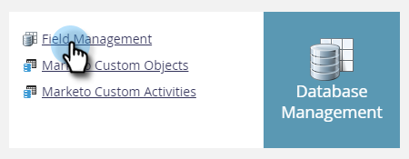

# Exportar todos os metadados do objeto {#export-all-object-metadata}

Esse recurso permite exportar todos os objetos e seus metadados.

>[!NOTE]
>
>**Permissões de administrador necessárias**

## Objetos {#objects}

* Campos de cliente em potencial (Pessoa/Empresa)
* Objetos personalizados do Marketo
* Atividades padrão
* Atividades personalizadas
* Canais
* Tags

## Exportar metadados do objeto {#export-object-metadata}

1. Vá para a área **[!UICONTROL Administrador]**.

   

1. Clique em **[!UICONTROL Gerenciamento de campos]**.

   

1. Clique em **[!UICONTROL Exportar Todos os Objetos]**.

   

>[!NOTE]
>
>Certifique-se de que seu navegador não esteja bloqueando pop-ups do Marketo.

Os dados serão exportados como CSV.

