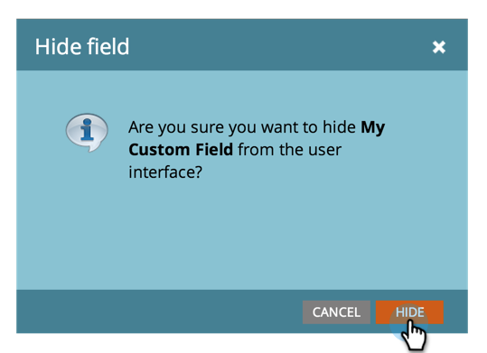

# Ocultar e reexibir um campo {#hide-and-unhide-a-field}

Se você não precisar mais de um campo no Marketo Engage, poderá ocultá-lo da interface do usuário para que ele não seja mais exibido no aplicativo.

## Ocultar um campo {#hide-a-field}

>[!NOTE]
>
>**Permissões de administrador são necessárias**

1. Vá para a área **[!UICONTROL Administrador]**.

   

1. Clique em **[!UICONTROL Gerenciamento de campos]**.

   

1. Localize o campo, selecione-o e, em **[!UICONTROL Ações do Campo]**, clique em **[!UICONTROL Ocultar Campo]**.

   

   >[!NOTE]
   >
   >* Para ocultar um campo, ele não deve estar associado a outros ativos (incluindo os arquivados). Remova o campo de todas as Smart Lists, opções de etapas de fluxo, formulários, emails, etc., antes de ocultar.
   >* Não é possível ocultar campos padrão (sistema).
   >* Não é possível ocultar campos de informações da oportunidade.

1. Clique em **[!UICONTROL Ocultar]** para confirmar.

   

   Agora você sabe como ocultar um campo da interface do Marketo.

   

## Reexibir um campo {#unhide-a-field}

1. Vá para a área **[!UICONTROL Administrador]**.

   

1. Clique em **[!UICONTROL Gerenciamento de campos]**.

   

1. Localize e selecione o campo. No menu suspenso [!UICONTROL Ações do Campo], clique em **[!UICONTROL Reexibir Campo]**.

   

   Agora você sabe como reexibir campos e torná-los visíveis novamente.
