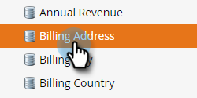

# Marcar campo como confidencial {#mark-a-field-as-sensitive}

Como administrador do Marketo, você pode marcar um campo específico como &quot;confidencial&quot; para que seus valores nunca sejam preenchidos previamente em formulários, protegendo, assim, os dados confidenciais dos usuários.

1. Clique em **[!UICONTROL Administrador]**.

   

1. Clique em **[!UICONTROL Gerenciamento de campos]**.

   

1. Localize e selecione o campo desejado.

   

1. Marque a caixa de seleção **[!UICONTROL Marcar campo como confidencial]**.

   
