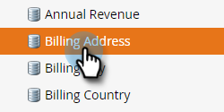

# Marcar um campo como confidencial {#mark-a-field-as-sensitive}

Como administrador do Marketo, você pode marcar um campo específico como &quot;sensível&quot; para que seus valores nunca sejam preenchidos previamente em formulários, protegendo assim os dados confidenciais dos usuários.

1. Clique em **Admin**.

   

1. Clique em **Gerenciamento de campo**.

   

1. Localize e selecione o campo desejado.

   

1. Marque a caixa de seleção **Marcar campo como confidencial**.

   

E é isso! A partir de agora, todos os formulários Marketo ativados com preenchimento prévio não exibirão dados para o campo selecionado.
