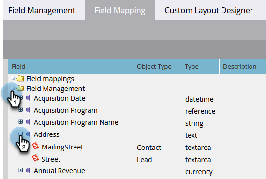

# Exibir Mapeamentos de Campos entre o Marketo e [!DNL Salesforce] {#view-field-mappings-between-marketo-and-salesforce}

Talvez você queira saber a quais [!DNL Salesforce] campos um campo específico do Marketo está vinculado. Veja como verificar.

>[!NOTE]
>
>**Permissões de administrador são necessárias**

1. Vá para a área **[!UICONTROL Administrador]**.

   

1. Clique em **[!UICONTROL Gerenciamento de campos]**.

   

1. Encontre o campo que você está interessado em ver e clique em **+** para expandir o mapeamento.

   

>[!NOTE]
>
>Isto está exibindo o nome da API [!DNL Salesforce], não o nome do rótulo.

>[!IMPORTANT]
>
>Os campos listados refletem apenas os dados do mapeamento inicial. Eles não são atualizados após a sincronização do Marketo/[!DNL Salesforce].
