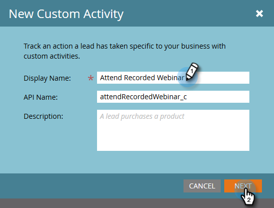

# Criar uma atividade personalizada {#create-a-custom-activity}

Siga estas etapas para criar uma nova atividade personalizada.

>[!NOTE]
>
>A maioria das assinaturas tem um limite alocado de 10 tipos de atividades personalizadas.

1. Vá para a área **[!UICONTROL Administrador]**.

   

1. Clique em **[!UICONTROL Atividades personalizadas do Marketo]**.

   

1. Clique em **[!UICONTROL Nova atividade personalizada]**.

   

1. Insira um nome e uma [!UICONTROL Descrição] opcional, depois clique em **[!UICONTROL Avançar]**. O Nome da API é preenchido automaticamente, mas pode ser personalizado.

   

   >[!CAUTION]
   >
   >Se você decidir alterar o [!UICONTROL Nome da API], verifique se o nome não entra em conflito com campos em outras atividades personalizadas.

1. Defina seu [!UICONTROL Filtro] e [!UICONTROL Acionador] e clique em **[!UICONTROL Avançar]**.

   

1. Dê ao seu campo principal um **[!UICONTROL Nome]** que resume para que serve a atividade personalizada.

   

>[!MORELIKETHIS]
>
>[Noções básicas sobre atividades personalizadas](/help/marketo/product-docs/administration/marketo-custom-activities/understanding-custom-activities.md)
