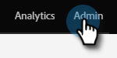

# Exportação de metadados de atividade personalizada {#custom-activity-metadata-export}

Siga as etapas abaixo para exportar seu esquema de metadados de atividade personalizado.

1. Em Minha Marketo, clique em **[!UICONTROL Administrador]**.

   

1. Clique em **[!UICONTROL Atividades personalizadas do Marketo]**.

   

1. Selecione a Atividade personalizada do Marketo que deseja exportar.

   

1. Clique no menu suspenso **[!UICONTROL Ações de atividade personalizadas]** e selecione **[!UICONTROL Atividade de exportação]**.

   

>[!NOTE]
>
>A atividade personalizada deve estar no estado Aprovado para ser exportada.

Agora você tem uma planilha com o Schema da Atividade personalizada, em três guias.
