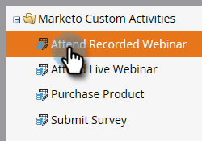
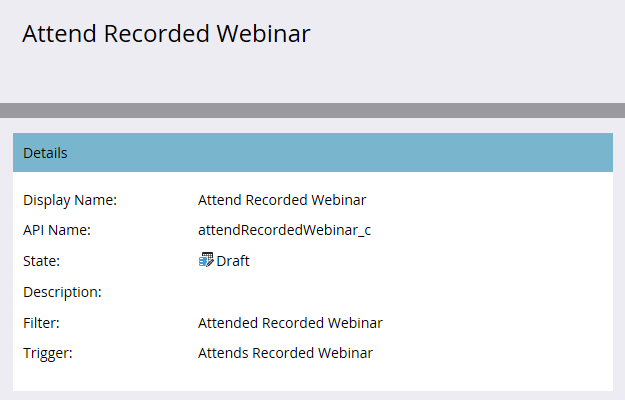

# Publicar uma atividade personalizada {#publish-a-custom-activity}

Saiba como publicar sua atividade personalizada.

1. Vá para a área **[!UICONTROL Administrador]**.

   

1. Clique em **[!UICONTROL Atividades personalizadas do Marketo]**.

   

1. Selecione a atividade personalizada que deseja publicar.

   

1. Clique no menu suspenso **[!UICONTROL Ações de atividade personalizadas]** e selecione **[!UICONTROL Atividade de publicação]**.

   

   O [!UICONTROL Estado] da atividade personalizada foi alterado de [!UICONTROL Rascunho]...

   

   ...para [!UICONTROL Publicado].

   
