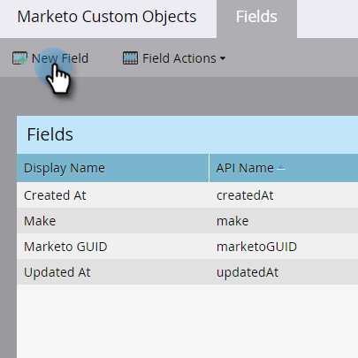
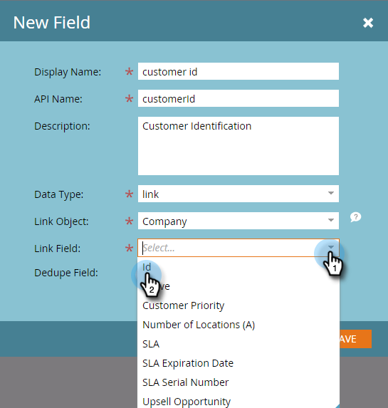
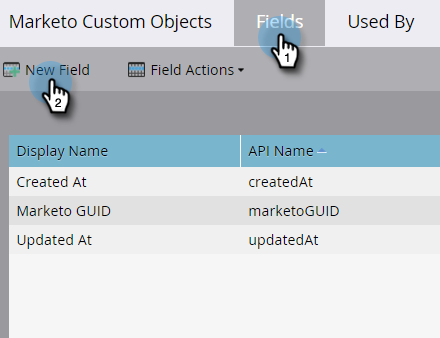
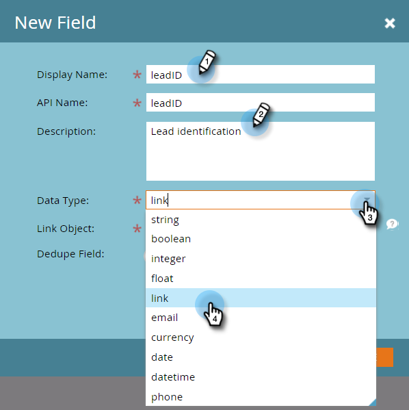
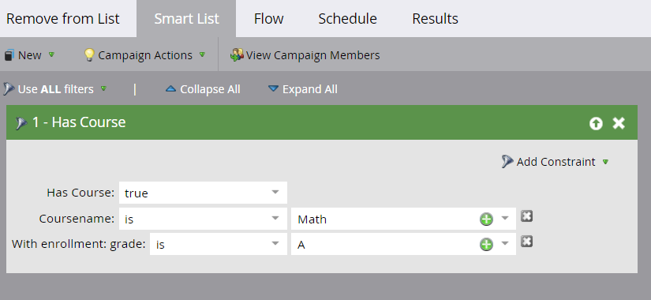

# Adicionar campos de link de objeto personalizado do Marketo {#add-marketo-custom-object-link-fields}

Ao criar objetos personalizados, você deve fornecer campos de link para conectar o registro de objeto personalizado ao registro pai correto.

* Para uma estrutura personalizada de um para muitos, use o campo de link no objeto personalizado para conectá-lo a uma pessoa ou empresa.
* Para uma estrutura muitos para muitos, você usa dois campos de link, conectados de um objeto intermediário criado separadamente (que também é um tipo de objeto personalizado). Um link se conecta a pessoas ou empresas no banco de dados e o outro se conecta ao objeto personalizado. Nesse caso, o campo de link não está localizado no próprio objeto personalizado.

## Criar um campo de link para uma estrutura de um para muitos {#create-a-link-field-for-a-one-to-many-structure}

Veja como criar um campo de link em um objeto personalizado para uma estrutura de um para muitos.

1. Vá para a **[!UICONTROL Admin]** área.

   

1. Clique em **[!UICONTROL Objetos personalizados do Marketo]**.

   

1. Selecione o objeto personalizado na lista.

   

1. No **[!UICONTROL Campos]** clique em **[!UICONTROL Novo campo]**.

   

1. Nomeie o campo de link e adicione um campo opcional [!UICONTROL Descrição]. Selecione o [!UICONTROL Link] tipo de dados.

   

   >[!CAUTION]
   >
   >Você não poderá voltar e criar, editar ou excluir um [!UICONTROL Link] ou [!UICONTROL Campo de desduplicação] assim que o objeto personalizado for aprovado.

1. Selecione se a variável [!UICONTROL Vincular objeto] é para um [!UICONTROL lead] (pessoa) [!UICONTROL empresa].

   

   >[!NOTE]
   >
   >Se você escolher [!UICONTROL lead], você verá ID, endereço de email e quaisquer campos personalizados na lista.
   >
   >Se você escolher [!UICONTROL empresa], você verá a ID e todos os campos personalizados na lista.

1. Selecione o [!UICONTROL Campo de link] que você deseja conectar como o principal do novo campo.

   

   >[!NOTE]
   >
   >Somente os tipos de campo de sequência são aceitos no campo de link.

1. Clique em **[!UICONTROL Salvar]**.

   

## Criar um campo de link para uma estrutura muitos para muitos {#create-a-link-field-for-a-many-to-many-structure}

Veja como criar um campo de link em um objeto intermediário para uso em uma estrutura muitos para muitos.

>[!PREREQUISITES]
>
>Você já deve ter criado o objeto intermediário e quaisquer objetos personalizados aos quais pretende vinculá-lo.

1. Vá para a **[!UICONTROL Admin]** área.

   

1. Clique em **[!UICONTROL Objetos personalizados do Marketo]**.

   

1. Selecione o objeto intermediário ao qual deseja adicionar o campo.

   

1. No **[!UICONTROL Campos]** clique em **[!UICONTROL Novo campo]**.

   

1. Você precisa criar dois campos de link. Crie um de cada vez. Primeiro, nomeie o campo para os membros da lista do banco de dados (leadID, por exemplo). Adicione um opcional [!UICONTROL Descrição]. Selecione o [!UICONTROL link] [!UICONTROL Tipo de dados].

   

   >[!CAUTION]
   >
   >Você não poderá voltar e criar, editar ou excluir um [!UICONTROL Link] ou [!UICONTROL Campo de desduplicação] assim que o objeto personalizado for aprovado.

1. Selecione o [!UICONTROL Vincular objeto] do banco de dados; nesse caso, [!UICONTROL Lead].

   

1. Selecione o [!UICONTROL Campo de link] que você deseja conectar, nesse caso, [!UICONTROL ID].

   

   >[!NOTE]
   >
   >Somente os tipos de campo de sequência são aceitos no [!UICONTROL Campo de link].

1. Clique em **[!UICONTROL Salvar]**.

   

1. Repita esse processo para o segundo link para seu objeto personalizado, neste exemplo, courseID. A variável [!UICONTROL Vincular objeto] o nome do curso será e o [!UICONTROL Campo de link] será courseID. Como você já criou e aprovou o objeto personalizado do curso, essas seleções estão disponíveis nos menus suspensos.

   

1. Crie quaisquer outros campos que deseja usar no objeto intermediário, como enrollmentID ou grade.

## Uso de objetos personalizados {#using-custom-objects}

A próxima etapa é usar esses objetos personalizados em filtros em suas campanhas inteligentes. Com uma relação muitos para muitos, você pode selecionar várias pessoas/empresas e vários objetos personalizados. No exemplo abaixo, qualquer pessoa no banco de dados que corresponda a esses critérios será listada. O campo nome do curso vem do objeto personalizado do curso e o nível de inscrição vem do objeto intermediário.

>[!MORELIKETHIS]
>
>* [Adicionar campos de objeto personalizados do Marketo](/help/marketo/product-docs/administration/marketo-custom-objects/add-marketo-custom-object-fields.md)
>* [Editar e excluir um objeto personalizado do Marketo](/help/marketo/product-docs/administration/marketo-custom-objects/edit-and-delete-a-marketo-custom-object.md)
>* [Noções básicas sobre objetos personalizados do Marketo](/help/marketo/product-docs/administration/marketo-custom-objects/understanding-marketo-custom-objects.md)
>* [Editar e excluir campos de objeto personalizado do Marketo](/help/marketo/product-docs/administration/marketo-custom-objects/edit-and-delete-marketo-custom-object-fields.md)

