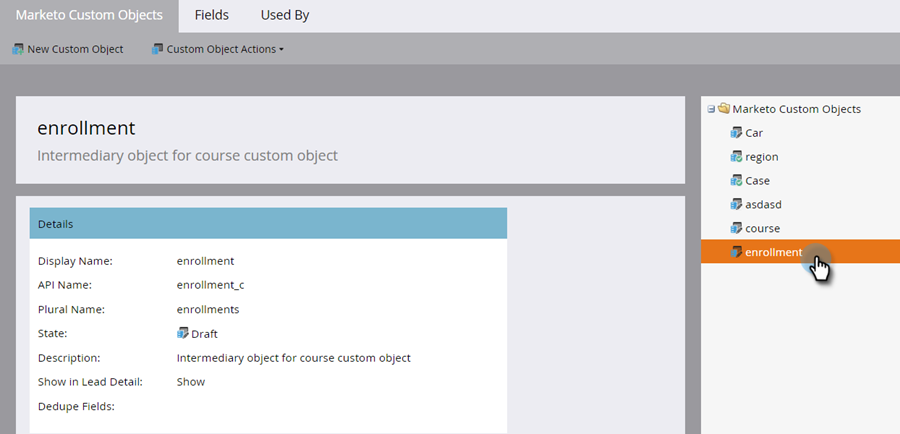
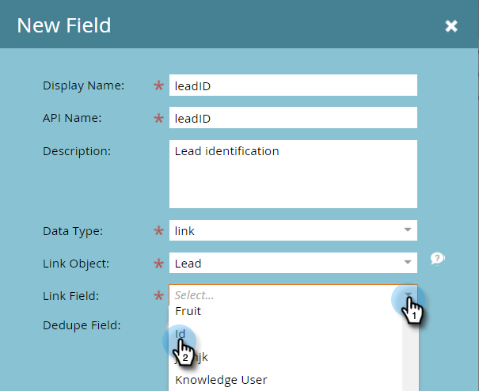

# Adicionar campos de link de objeto personalizado do Marketo {#add-marketo-custom-object-link-fields}

Ao criar objetos personalizados, é necessário fornecer campos de link para conectar o registro de objeto personalizado ao registro pai correto.

* Para uma estrutura personalizada one-to-many, use o campo link no objeto personalizado para conectá-lo a uma pessoa ou empresa.
* Para uma estrutura muitas para muitas, você usa dois campos de link, conectados a partir de um objeto intermediário criado separadamente (que é também um tipo de objeto personalizado). Um link se conecta a pessoas ou empresas no banco de dados e o outro se conecta ao objeto personalizado. Nesse caso, o campo link não está localizado no próprio objeto personalizado.

## Criar um campo de link para uma estrutura de um para muitos {#create-a-link-field-for-a-one-to-many-structure}

Veja como criar um campo de link em um objeto personalizado para uma estrutura de um para muitos.

1. Vá para o **Administrador** área.

   

1. Clique em **Objetos personalizados do Marketo**.

   

1. Selecione o objeto personalizado na lista.

   

1. No **Campos** clique em **Novo campo**.

   

1. Nomeie o campo de link e adicione uma descrição opcional. Certifique-se de selecionar o tipo de dados Link .

   

   >[!CAUTION]
   >
   >Você não poderá voltar e criar, editar ou excluir um Link ou Campo de exclusão depois que o objeto personalizado for aprovado.

1. Selecione se o objeto de link é para um cliente potencial (pessoa) ou uma empresa.

   

   >[!NOTE]
   >
   >Se você escolher lead, verá ID, endereço de email e quaisquer campos personalizados na lista.
   >
   >Se você escolher empresa, verá ID e quaisquer campos personalizados na lista.

1. Selecione o campo de link ao qual deseja se conectar como o pai do novo campo.

   

   >[!NOTE]
   >
   >Somente os tipos de campos de cadeia de caracteres são suportados no campo de link.

1. Clique em **Salvar.**

   

## Criar um campo de link para uma estrutura de muitas para muitas {#create-a-link-field-for-a-many-to-many-structure}

Veja como criar um campo de link em um objeto intermediário para uso em uma estrutura muitos para muitos.

>[!PREREQUISITES]
>
>Você já deve ter criado o objeto intermediário e quaisquer objetos personalizados aos quais pretende vinculá-lo.

1. Vá para o **Administrador** área.

   

1. Clique em **Objetos personalizados do Marketo**.

   

1. Selecione o objeto intermediário ao qual deseja adicionar o campo.

   

1. No **Campos** clique em **Novo campo**.

   

1. É necessário criar dois campos de link. Crie um de cada vez. Primeiro, nomeie o campo para os membros da lista do banco de dados (leadID, por exemplo). Adicione uma descrição opcional. Certifique-se de selecionar o tipo de dados do link.

   

   >[!CAUTION]
   >
   >Você não poderá voltar e criar, editar ou excluir um Link ou Campo de exclusão depois que o objeto personalizado for aprovado.

1. Selecione o objeto de link do banco de dados, neste caso Lead.

   

1. Selecione o campo de link ao qual você deseja se conectar, neste caso, Id.

   

   >[!NOTE]
   >
   >Somente os tipos de campos de cadeia de caracteres são suportados no campo de link.

1. Clique em **Salvar.**

   

1. Repita esse processo para o segundo link para o objeto personalizado, neste exemplo, CourseID. O Nome do objeto do link será exibido e o Campo do link será ID do curso. Como você já criou e aprovou o objeto personalizado do curso, essas seleções estão disponíveis nos menus suspensos.

   

1. Crie quaisquer outros campos que você deseja usar no objeto intermediário, como enrollmentID ou grade.

## Uso de objetos personalizados {#using-custom-objects}

A próxima etapa é usar esses objetos personalizados em filtros em suas campanhas inteligentes. Com uma relação muitos para muitos, você pode selecionar várias pessoas/empresas e vários objetos personalizados. No exemplo abaixo, qualquer pessoa no banco de dados que corresponda a esses critérios será listada. O campo coursename vem do objeto personalizado do curso e o nível de inscrição vem do objeto intermediário.

>[!MORELIKETHIS]
>
>* [Adicionar campos de objeto personalizados do Marketo](/help/marketo/product-docs/administration/marketo-custom-objects/add-marketo-custom-object-fields.md)
>* [Editar e excluir um objeto personalizado do Marketo](/help/marketo/product-docs/administration/marketo-custom-objects/edit-and-delete-a-marketo-custom-object.md)
>* [Como entender objetos personalizados do Marketo](/help/marketo/product-docs/administration/marketo-custom-objects/understanding-marketo-custom-objects.md)
>* [Editar e excluir campos de objeto personalizados do Marketo](/help/marketo/product-docs/administration/marketo-custom-objects/edit-and-delete-marketo-custom-object-fields.md)

