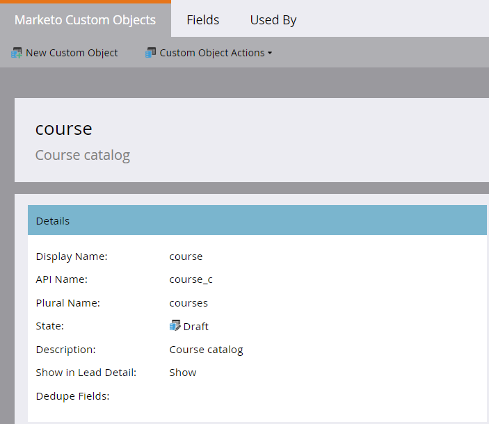

# Criar objetos personalizados de marketing {#create-marketo-custom-objects}

Use objetos personalizados no Marketo para rastrear métricas específicas para sua empresa. Isto pode ser qualquer coisa, desde carros, até cursos, qualquer coisa que você queira modelar no Marketo para administrar suas campanhas.

>[!NOTE]
>
>É possível configurar objetos personalizados para funcionar com base em um para muitos ou muitos para muitos. Você cria o objeto inicial da mesma maneira, mas as etapas são diferentes ao start de adicionar campos ao objeto. Consulte [Compreensão de objetos](understanding-marketo-custom-objects.md) personalizados de marketing para obter mais informações.

>[!NOTE]
>
>Não é possível criar, editar ou excluir um Link ou um Campo de exclusão depois que o objeto personalizado é aprovado.

## Criar um objeto personalizado para uma estrutura de um para muitos {#create-a-custom-object-for-a-one-to-many-structure}

Este exemplo mostra um objeto personalizado Carro, para uso em uma estrutura um para muitos. Posteriormente, você criará um objeto personalizado do curso e um objeto intermediário para usar em uma estrutura muitas para muitas.

1. Clique em **Admin** e, em Gerenciamento **de** banco de dados, selecione **Marketo Custom Objects**.

   ** 

   **

1. Clique em **Novo objeto** personalizado.

   

   >[!NOTE]
   >
   >A guia Marketo Custom Objects (Objetos personalizados de marketing) exibe todos os objetos personalizados à direita e detalhes de quaisquer objetos aprovados, incluindo o número de registros e campos na atualização mais recente.

1. Insira um nome para exibição. O Nome da API e o Nome do plural são preenchidos automaticamente. Insira uma descrição (opcional).

   

   >[!NOTE]
   >
   >Você pode editar esses campos ao criá-los, mas depois que eles forem salvos, você só poderá editar o campo Nome do plural e o controle deslizante **Mostrar em detalhes** do cliente potencial.

1. Puxe o **Show in Lead Detail **controle deslizante para exibir **Mostrar** se você quiser visualização dados de objetos personalizados na página Banco de Dados de Cliente Potencial. Clique em **Salvar**.

   

1. As informações do objeto personalizado exibem o conteúdo inserido. Observe que está em um estado de Rascunho.

   

   A próxima etapa é adicionar campos para [criar seu objeto](add-marketo-custom-object-fields.md)personalizado.

   >[!NOTE]
   >
   >Você só pode preencher objetos personalizados de marketing por uma importação de lista ou pela [API](http://developers.marketo.com/documentation/rest/).

## Criar um objeto personalizado para uma estrutura de muitos para muitos {#create-a-custom-object-for-a-many-to-many-structure}

Este exemplo mostra um objeto personalizado do curso, que você usará para criar uma relação muitos para muitos entre pessoas/empresas e cursos. Quando terminar, você criará um objeto intermediário para conectá-lo a pessoas ou empresas em seu banco de dados.

>[!NOTE]
>
>Para uma relação muitos para muitos, não é necessário criar um link no objeto personalizado. Em vez disso, você adicionará dois links ao objeto intermediário (consulte abaixo).

1. Clique em **Admin** e, em Gerenciamento **de** banco de dados, selecione **Marketo Custom Objects**.

   

1. Clique em **Novo objeto** personalizado.

   

1. Insira um nome para exibição. O Nome da API e o Nome do plural são preenchidos automaticamente. Insira uma descrição (opcional).

   

   >[!NOTE]
   >
   >Você pode editar esses campos ao criá-los, mas depois que eles forem salvos, você só poderá editar o campo Nome do plural e o controle deslizante **Mostrar em detalhes** do cliente potencial.

1. Puxe o **Show in Lead Detail **controle deslizante para exibir Mostrar se você deseja visualização dados de objeto personalizados na página Banco de Dados de Cliente Potencial. Clique em **Salvar**.

   

1. As informações do objeto personalizado exibem o conteúdo inserido. Observe que está em um estado de Rascunho.

   

   >[!NOTE]
   >
   >Você só pode preencher objetos personalizados de marketing por uma importação de lista ou pela [API](http://developers.marketo.com/documentation/rest/).

A próxima etapa é criar seu objeto intermediário (veja abaixo). Mas antes disso, você precisa criar um campo para se conectar com ele.

## Criar um objeto intermediário {#create-an-intermediary-object}

Use um objeto intermediário para conectar um objeto personalizado a pessoas ou empresas. Neste exemplo, ele é usado para conectar cursos em seu objeto personalizado do curso a pessoas ou empresas em seu banco de dados.

>[!NOTE]
>
>Não é necessário criar um objeto intermediário para uma estrutura de objeto personalizada um para muitos.

1. Clique em **Admin** e, em Gerenciamento **de** banco de dados, selecione **Marketo Custom Objects**.

   

1. Clique em **Novo objeto** personalizado.

   

1. Insira um nome para exibição. O Nome da API e o Nome do plural são preenchidos automaticamente. Insira uma descrição (opcional).

   

   >[!NOTE]
   >
   >Você pode editar esses campos ao criá-los, mas depois que eles forem salvos, você só poderá editar o campo Nome do plural e o controle deslizante Mostrar em detalhes do cliente potencial.

1. Puxe o controle deslizante **Mostrar em detalhes** de cliente potencial para exibir Mostrar se você deseja visualização dados de objeto personalizado na página Banco de dados de cliente potencial. Clique em **Salvar**.

   

1. As informações do objeto personalizado exibem o conteúdo inserido. Observe que está em um estado de Rascunho.

   A próxima etapa é [adicionar campos](add-marketo-custom-object-link-fields.md) de link para conectar seu objeto intermediário a uma pessoa/empresa e a um objeto personalizado.

>[!MORELIKETHIS]
>
>* [Adicionar campos de objeto personalizados de marketing](add-marketo-custom-object-fields.md)
>* [Adicionar campos de link de objeto personalizado de marketing](add-marketo-custom-object-link-fields.md)
>* [Como entender objetos personalizados de marketing](understanding-marketo-custom-objects.md)

>

