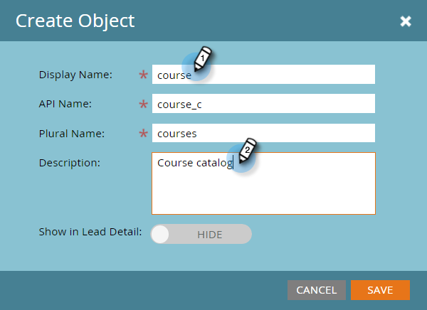
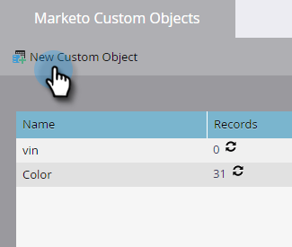

# Criar objetos personalizados do Marketo {#create-marketo-custom-objects}

Use objetos personalizados no Marketo para rastrear métricas específicas para sua empresa. Pode ser de carros a cursos, seja qual for o modelo que você queira usar no Marketo para executar suas campanhas.

>[!NOTE]
>
>Você pode configurar objetos personalizados para funcionarem de um para muitos ou de muitos para muitos. Você cria o objeto inicial da mesma maneira, mas as etapas são diferentes quando começa a adicionar campos ao objeto. Consulte [Entendendo os objetos personalizados do Marketo](/help/marketo/product-docs/administration/marketo-custom-objects/understanding-marketo-custom-objects.md) para obter mais informações.

>[!NOTE]
>
>Não é possível criar, editar ou excluir um Link ou Campo de desduplicação depois que o objeto personalizado é aprovado.

## Criar um objeto personalizado para uma estrutura de um para muitos {#create-a-custom-object-for-a-one-to-many-structure}

Este exemplo mostra um objeto personalizado Car para uso em uma estrutura de um para muitos. Posteriormente, você criará um objeto personalizado do curso e um objeto intermediário para usar em uma estrutura muitos para muitos.

1. Vá para a área **[!UICONTROL Administrador]**.

   

1. Clique em **[!UICONTROL Objetos personalizados do Marketo]**.

   

1. Clique em **[!UICONTROL Novo objeto personalizado]**.

   

   >[!NOTE]
   >
   >A guia [!UICONTROL Objetos Personalizados do Marketo] exibe todos os objetos personalizados à direita e detalhes de todos os aprovados, incluindo o número de registros e campos na atualização mais recente.

1. Insira um [!UICONTROL Nome para Exibição]. O [!UICONTROL Nome da API] e o [!UICONTROL Nome do Plural] são preenchidos automaticamente. Insira uma [!UICONTROL Descrição] (opcional).

   

   >[!NOTE]
   >
   >Você pode editar esses campos ao criá-los, mas depois de salvá-los, você só poderá editar o campo [!UICONTROL Nome no Plural] e o controle deslizante **[!UICONTROL Mostrar Detalhes do Cliente Potencial]**.

1. Puxe o controle deslizante **[!UICONTROL Mostrar em Detalhes do Cliente Potencial]** para exibir **[!UICONTROL Mostrar]** se desejar exibir dados do objeto personalizado na página Banco de Dados. Clique em **[!UICONTROL Salvar]**.

   

1. As informações do objeto personalizado exibem o conteúdo inserido. Observe que ele está em um estado de **[!UICONTROL Rascunho]**.

   

   A próxima etapa é adicionar campos para [criar seu objeto personalizado](/help/marketo/product-docs/administration/marketo-custom-objects/add-marketo-custom-object-fields.md).

   >[!NOTE]
   >
   >Você só pode preencher Objetos Personalizados do Marketo por meio de uma importação de lista ou pela [API](https://experienceleague.adobe.com/en/docs/marketo-developer/marketo/rest/rest-api).

## Criar um objeto personalizado para uma estrutura muitos para muitos {#create-a-custom-object-for-a-many-to-many-structure}

Este exemplo mostra um objeto personalizado do curso, que você usará para criar uma relação muitos para muitos entre pessoas/empresas e cursos. Quando terminar, você criará um objeto intermediário para conectá-lo às pessoas ou empresas no banco de dados.

>[!NOTE]
>
>Para uma relação muitos para muitos, não é necessário criar um link no objeto personalizado. Em vez disso, você adicionará dois links ao objeto intermediário (veja abaixo).

1. Vá para a área **[!UICONTROL Administrador]**.

   

1. Clique em **[!UICONTROL Objetos personalizados do Marketo]**.

   

1. Clique em **[!UICONTROL Novo objeto personalizado]**.

   

1. Insira um [!UICONTROL Nome para Exibição]. O [!UICONTROL Nome da API] e o [!UICONTROL Nome do Plural] são preenchidos automaticamente. Insira uma [!UICONTROL Descrição] (opcional).

   

   >[!NOTE]
   >
   >Você pode editar esses campos ao criá-los, mas depois de salvá-los, você só poderá editar o campo [!UICONTROL Nome no Plural] e o controle deslizante **[!UICONTROL Mostrar Detalhes do Cliente Potencial]**.

1. Puxe o controle deslizante **[!UICONTROL Mostrar em Detalhes do Cliente Potencial]** para exibir **[!UICONTROL Mostrar]** se desejar exibir dados do objeto personalizado na página Banco de Dados. Clique em **[!UICONTROL Salvar]**.

   

1. As informações do objeto personalizado exibem o conteúdo inserido. Observe que ele está em um estado de **[!UICONTROL Rascunho]**.

   

   >[!NOTE]
   >
   >Você só pode preencher Objetos Personalizados do Marketo por meio de uma importação de lista ou pela [API](https://experienceleague.adobe.com/en/docs/marketo-developer/marketo/rest/rest-api).

A próxima etapa é criar o objeto intermediário (veja abaixo). Mas antes disso, é necessário criar um campo para vincular com ele.

## Criar um Objeto Intermediário {#create-an-intermediary-object}

Use um objeto intermediário para conectar um objeto personalizado a pessoas ou empresas. Neste exemplo, ele é usado para conectar cursos no objeto personalizado do curso a pessoas ou empresas no banco de dados.

>[!NOTE]
>
>Não é necessário criar um objeto intermediário para uma estrutura de objeto personalizado de um para muitos.

1. Vá para a área **[!UICONTROL Administrador]**.

   

1. Clique em **[!UICONTROL Objetos personalizados do Marketo]**.

   

1. Clique em **[!UICONTROL Novo objeto personalizado]**.

   

1. Insira um [!UICONTROL Nome para Exibição]. O [!UICONTROL Nome da API] e o [!UICONTROL Nome do Plural] são preenchidos automaticamente. Insira uma [!UICONTROL Descrição] (opcional).

   

   >[!NOTE]
   >
   >Você pode editar esses campos ao criá-los, mas depois de salvá-los, você só poderá editar o campo [!UICONTROL Nome no Plural] e o controle deslizante [!UICONTROL Mostrar Detalhes do Cliente Potencial].

1. Puxe o controle deslizante **[!UICONTROL Mostrar em Detalhes do Cliente Potencial]** para exibir **Mostrar** se desejar exibir dados do objeto personalizado na página Banco de Dados. Clique em **Salvar**.

   

1. As informações do objeto personalizado exibem o conteúdo inserido. Observe que ele está em um estado de **[!UICONTROL Rascunho]**.

   A próxima etapa é [adicionar campos de link](/help/marketo/product-docs/administration/marketo-custom-objects/add-marketo-custom-object-link-fields.md) para conectar seu objeto intermediário a uma pessoa/empresa e a um objeto personalizado.

>[!MORELIKETHIS]
>
>* [Adicionar campos de objeto personalizado do Marketo](/help/marketo/product-docs/administration/marketo-custom-objects/add-marketo-custom-object-fields.md)
>* [Adicionar campos de link de objeto personalizado do Marketo](/help/marketo/product-docs/administration/marketo-custom-objects/add-marketo-custom-object-link-fields.md)
>* [Noções básicas sobre objetos personalizados do Marketo](/help/marketo/product-docs/administration/marketo-custom-objects/understanding-marketo-custom-objects.md)
