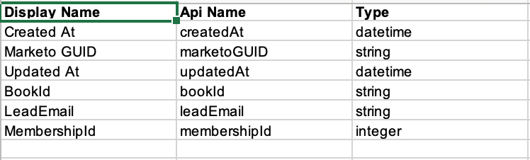

# Exportação de metadados de objeto personalizado {#custom-object-metadata-export}

Se você estiver usando nossa API SOAP ou Munchkin, o esquema de metadados do objeto personalizado pode ser exportado. Veja como obtê-lo.

>[!AVAILABILITY]
>
>Nem todos os usuários do Marketo Engage compraram essa funcionalidade. Entre em contato com a equipe de conta do Adobe (seu gerente de conta) para obter mais detalhes.

1. Vá para a **[!UICONTROL Admin]** área.

   

1. Clique em **[!UICONTROL Objetos personalizados do Marketo]**.

   

1. Selecione o Objeto personalizado do Marketo que deseja exportar.

   

1. Clique em **[!UICONTROL Ações do objeto personalizado]** e selecione **[!UICONTROL Exportar objeto]**.

   

>[!NOTE]
>
>O objeto personalizado deve estar no estado aprovado para ser exportado.

Agora você tem uma planilha com o Esquema do Objeto personalizado em três guias.

