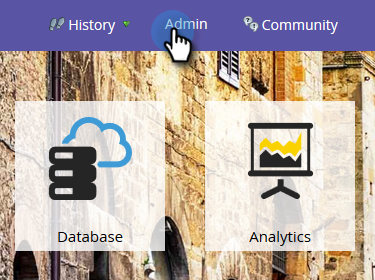
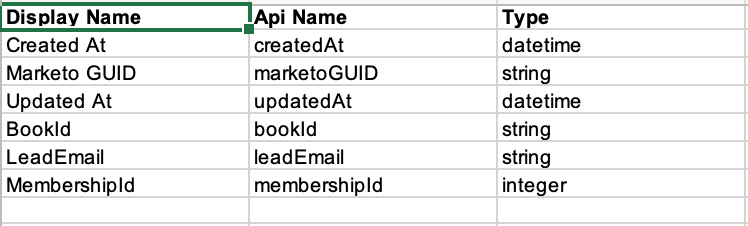

# Exportação de metadados de objeto personalizado {#custom-object-metadata-export}

Se você estiver usando nossa API do SOAP ou a API [!DNL Munchkin], o Esquema de metadados do objeto personalizado pode ser exportado. Veja como obtê-lo.

>[!AVAILABILITY]
>
>Nem todos os usuários do Marketo Engage compraram essa funcionalidade. Entre em contato com a equipe de conta da Adobe (seu gerente de conta) para obter mais detalhes.

1. Vá para a área **[!UICONTROL Administrador]**.

   

1. Clique em **[!UICONTROL Objetos personalizados do Marketo]**.

   

1. Selecione o Objeto personalizado do Marketo que deseja exportar.

   

1. Clique no menu suspenso **[!UICONTROL Ações de Objetos Personalizados]** e selecione **[!UICONTROL Exportar Objeto]**.

   

>[!NOTE]
>
>O objeto personalizado deve estar no estado aprovado para ser exportado.

Agora você tem uma planilha com o Esquema do Objeto personalizado em três guias.

