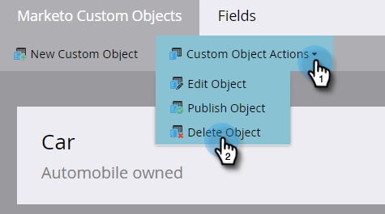

# Editar e excluir um objeto personalizado do Marketo {#edit-and-delete-a-marketo-custom-object}

>[!NOTE]
>
>Não é possível criar, editar ou excluir um Link ou Campo de desduplicação depois que o objeto personalizado é aprovado.

## Editar um objeto personalizado {#edit-a-custom-object}

Use o menu Ações de objetos personalizados para editar ou excluir um objeto personalizado.

1. Vá para a área **[!UICONTROL Administrador]**.

   

1. Clique em **[!UICONTROL Objetos personalizados do Marketo]**.

   

1. Selecione o objeto personalizado que deseja editar à direita.

   

1. Clique na guia **[!UICONTROL Ações de Objeto Personalizado]** e clique em **[!UICONTROL Editar Objeto]**.

   

1. Faça as alterações desejadas. Arraste o controle deslizante sobre se desejar mostrar o objeto na página Detalhes do lead. Clique em **[!UICONTROL Salvar]**.

   

1. Certifique-se de aprovar [o objeto editado](/help/marketo/product-docs/administration/marketo-custom-objects/approve-a-custom-object.md).

## Excluir um objeto personalizado {#delete-a-custom-object}

É fácil excluir um objeto personalizado, mas você precisa ter cuidado. Os objetos personalizados podem ser conectados a outros objetos ou a listas inteligentes. Portanto, a Marketo avisa antes de permitir que você clique em **[!UICONTROL Excluir]**.

>[!CAUTION]
>
>Não é possível restaurar um objeto personalizado depois de excluí-lo.

1. Vá para a área **[!UICONTROL Administrador]**.

   

1. Clique em **[!UICONTROL Objetos personalizados do Marketo]**.

   

1. Selecione o objeto que deseja deletar.

   

1. Clique em **[!UICONTROL Ações de Objeto Personalizado]** e selecione **[!UICONTROL Excluir Objeto]**.

   

   >[!TIP]
   >
   >Você também pode clicar com o botão direito do mouse no objeto e selecionar **[!UICONTROL Excluir objeto]**.

1. Se o objeto personalizado estiver no formato de rascunho, ainda não aprovado, você receberá este aviso. Se tiver certeza, clique em **[!UICONTROL Excluir]**.

   

1. Se o objeto personalizado já estiver aprovado, haverá maior risco se você excluí-lo. Então, você vai receber esse aviso mais forte. Insira **[!UICONTROL Entendo]**, marque a caixa de seleção **[!UICONTROL Não é possível desfazer]** e clique em **[!UICONTROL Excluir]**.

   

   >[!NOTE]
   >
   >Se o objeto personalizado estiver vinculado a um objeto intermediário, você deverá deletá-lo primeiro.

>[!MORELIKETHIS]
>
>[Aprovar um Objeto Personalizado](/help/marketo/product-docs/administration/marketo-custom-objects/approve-a-custom-object.md)
