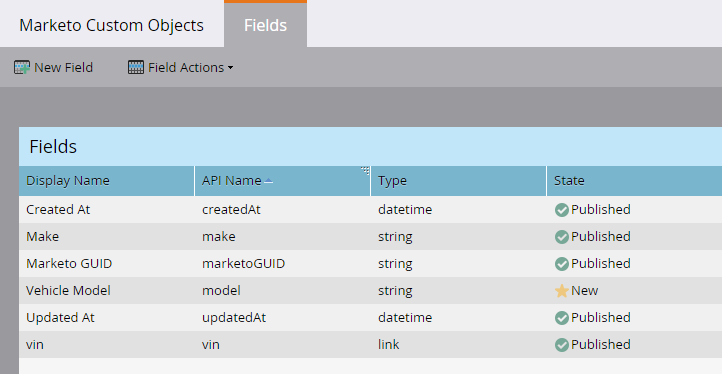

# Editar e excluir campos de objetos personalizados de marketing {#edit-and-delete-marketo-custom-object-fields}

## Editar um campo {#edit-a-field}

Às vezes, é necessário editar um campo que ainda não foi aprovado.

1. Clique em um objeto personalizado e no campo que deseja editar.

   

1. Na guia Campos, clique em **Ações de campo** e **Editar campo**.

   

1. Faça as alterações e clique em **Salvar**.

   

   >[!NOTE]
   >
   >Não é possível editar o nome da API.

1. As alterações são exibidas na lista Campos.

   

## Excluir um campo {#delete-a-field}

Quando você não precisa mais de um campo em um objeto personalizado, é possível excluí-lo.

1. Na guia Campos, clique em **Ações de campo** e **Excluir campo**.

   

   Certifique-se de excluir o campo antes de puxar o acionador! Clique em **Excluir**.

   

1. Acabou!

   

   >[!NOTE]
   >
   >**Artigos relacionados**
   >
   >
   >[Adicionar campos de objeto personalizados de marketing](add-marketo-custom-object-fields.md)

