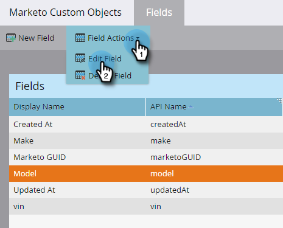

# Editar e excluir campos de objeto personalizado do Marketo {#edit-and-delete-marketo-custom-object-fields}

## Editar um campo {#edit-a-field}

Às vezes, é necessário editar um campo que ainda não foi aprovado.

1. Clique em um objeto personalizado e no campo que deseja editar.

   

1. Na guia [!UICONTROL Campos], clique em **[!UICONTROL Ações de Campo]** e **[!UICONTROL Editar Campo]**.

   

1. Faça as alterações e clique em **[!UICONTROL Salvar]**.

   

   >[!NOTE]
   >
   >Não é possível editar o Nome da API.

1. As alterações são exibidas na lista Campos.

   

## Excluir um campo {#delete-a-field}

Quando não precisar mais de um campo em um objeto personalizado, você poderá excluí-lo.

1. Na guia Campos, clique em **[!UICONTROL Ações do Campo]** e **[!UICONTROL Excluir Campo]**.

   

1. Certifique-se de que realmente deseja excluir o campo antes de puxar o gatilho! Clique em **[!UICONTROL Excluir]**.

   

Se foi!

>[!NOTE]
>
>[Adicionar campos de objeto personalizado do Marketo](/help/marketo/product-docs/administration/marketo-custom-objects/add-marketo-custom-object-fields.md)
