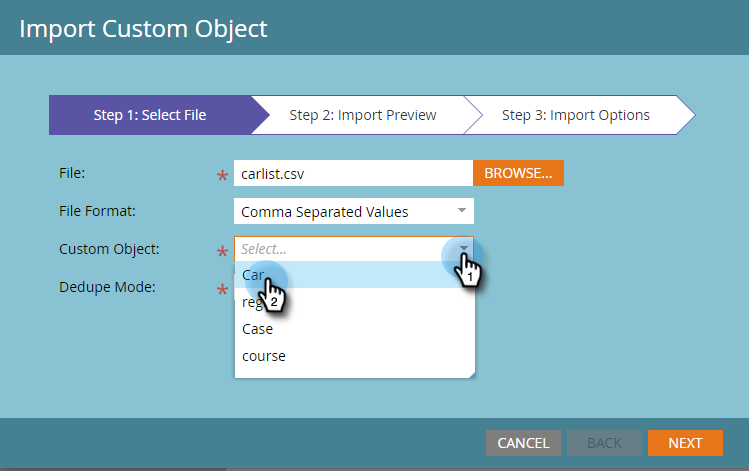

# Importar dados de objeto personalizados {#import-custom-object-data}

É fácil importar dados de objetos personalizados para o banco de dados. Se você estiver usando objetos personalizados com empresa, consulte [Usando objetos personalizados com Empresa](/help/marketo/product-docs/administration/marketo-custom-objects/understanding-marketo-custom-objects.md#using-custom-objects-with-companies) para obter mais informações.

1. Em Meu Marketo, vá para **Banco de Dados**.

   

1. Clique em **Novo** e selecione **Importar dados de objeto personalizados**.

   

1. Clique em **Procurar** para localizar o arquivo de dados. Selecione o formato de arquivo (Valores separados por vírgula neste exemplo).

   

1. Selecione seu objeto personalizado.

   

1. Selecione o Modo de depuração no menu suspenso. Clique em **Próximo**.

   

   >[!NOTE]
   >
   >Use os campos Dedupe como identificadores exclusivos ao criar ou atualizar registros de objetos personalizados. Este exemplo usa o campo Dedupe do objeto personalizado **car** vin (número de ID do veículo). Se você só estiver atualizando registros de objetos personalizados, poderá selecionar o Guia de marketing como o Modo de desduplicação.

1. Mapeie cada coluna para um campo de marketing, selecionando-a no menu suspenso.

   

   >[!NOTE]
   >
   >Certifique-se de que os valores no arquivo correspondem ao tipo de campo ao qual você os está fazendo a correspondência (por exemplo, texto, número inteiro, etc.); caso contrário, o arquivo será rejeitado.

1. Clique em **Próximo**.

   

1. Clique em **Importar**.

   

   >[!NOTE]
   >
   >O limite de tamanho para objetos personalizados é de 100 MB.

   >[!TIP]
   >
   >Insira seu endereço de email no campo **Enviar alerta para:** e o Marketo enviará um email para você quando a importação estiver concluída!

1. No canto superior direito da tela, você verá uma notificação enquanto a importação estiver sendo executada e os resultados finais quando for concluída.

   

   Sim!

>[!MORELIKETHIS]
>
>[Como entender objetos personalizados de marketing](/help/marketo/product-docs/administration/marketo-custom-objects/understanding-marketo-custom-objects.md)
