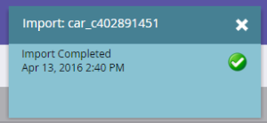

# Importar dados de objeto personalizado {#import-custom-object-data}

É fácil importar dados de objetos personalizados para o banco de dados. Se você estiver usando objetos personalizados com empresas, consulte [Usando Objetos Personalizados com Empresas](/help/marketo/product-docs/administration/marketo-custom-objects/understanding-marketo-custom-objects.md#using-custom-objects-with-companies) para obter mais informações.

1. Em Minha Marketo, vá para **[!UICONTROL Banco de Dados]**.

   

1. Clique em **[!UICONTROL Novo]** e selecione **[!UICONTROL Importar Dados do Objeto Personalizado]**.

   

1. Clique em **[!UICONTROL Procurar]** para localizar o arquivo de dados. Selecione o formato de arquivo (Valores separados por vírgula, neste exemplo).

   

1. Selecione seu [!UICONTROL objeto personalizado].

   

1. Selecione o [!UICONTROL Modo de Desduplicação] no menu suspenso. Clique em **[!UICONTROL Avançar]**.

   

   >[!NOTE]
   >
   >Use os campos Dedupe como identificadores exclusivos ao criar ou atualizar registros de objeto personalizado. Este exemplo usa o campo Dedupe do objeto personalizado **car** - vin (número de ID do veículo). Se você estiver atualizando apenas registros de objetos personalizados, poderá selecionar o [!UICONTROL Marketo Guid] como o [!UICONTROL Modo de Desduplicação].

1. Mapeie cada coluna para um campo do Marketo, selecionando-o no menu suspenso.

   

   >[!NOTE]
   >
   >Verifique se os valores no arquivo correspondem ao tipo de campo ao qual você está correspondendo (por exemplo, texto, número inteiro etc.); caso contrário, o arquivo será rejeitado.

1. Clique em **[!UICONTROL Avançar]**.

   

1. Clique em **[!UICONTROL Importar]**.

   

   >[!NOTE]
   >
   >O limite de tamanho para objetos personalizados é de 100 MB.

   >[!TIP]
   >
   >Digite seu endereço de email no campo **[!UICONTROL Enviar Alerta para]**, e o Marketo enviará um email quando a importação estiver concluída.

1. No canto superior direito da tela, você verá uma notificação enquanto a importação estiver em execução e os resultados finais quando ela for concluída.

   

   Sim!

>[!MORELIKETHIS]
>
>[Noções básicas sobre objetos personalizados do Marketo](/help/marketo/product-docs/administration/marketo-custom-objects/understanding-marketo-custom-objects.md)
