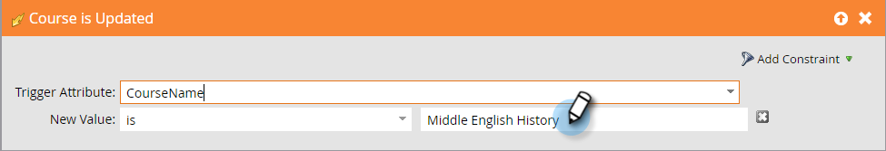

# Acionar Alterações de Objeto Personalizado {#trigger-off-custom-object-changes}

>[!NOTE]
>
>Este recurso está disponível apenas:
>
>* Para clientes na infraestrutura Orion
>* Para uso somente com objetos personalizados do Marketing, não objetos personalizados sincronizados por meio da integração nativa do Salesforce ou do Microsoft Dynamics
>* Como um acionador, não um filtro

>
>
Entre em contato com [Suporte a marketing](https://nation.marketo.com/t5/Support/ct-p/Support) para ativar os Acionadores de alteração de objeto personalizados.

Em uma lista inteligente de campanha inteligente, é possível acionar uma ação de fluxo quando um objeto personalizado é adicionado a uma pessoa ou empresa. Você também pode criar uma lista inteligente que usa *change* em um objeto personalizado como disparador. Por exemplo, use-o para enviar um email quando o nome de um curso for atualizado.

>[!NOTE]
>
>Uma entrada de registro de atividades não é criada quando um registro de objeto personalizado é alterado.

1. No Marketo, vá para **Atividades de marketing.**

   

1. Crie ou abra uma Campanha inteligente existente e selecione a Lista inteligente.

   

1. Procure o acionador de que você precisa e arraste-o para a tela de desenho.

   

1. Selecione o atributo de disparo.

   

1. Como opção, defina uma restrição.

   

1. E aí está você. A alteração é salva automaticamente.

   

   >[!NOTE]
   >
   >* [Criar uma Lista inteligente](/help/marketo/product-docs/core-marketo-concepts/smart-lists-and-static-lists/creating-a-smart-list/create-a-smart-list.md)
   >* [Como entender objetos personalizados de marketing](/help/marketo/product-docs/administration/marketo-custom-objects/understanding-marketo-custom-objects.md)

