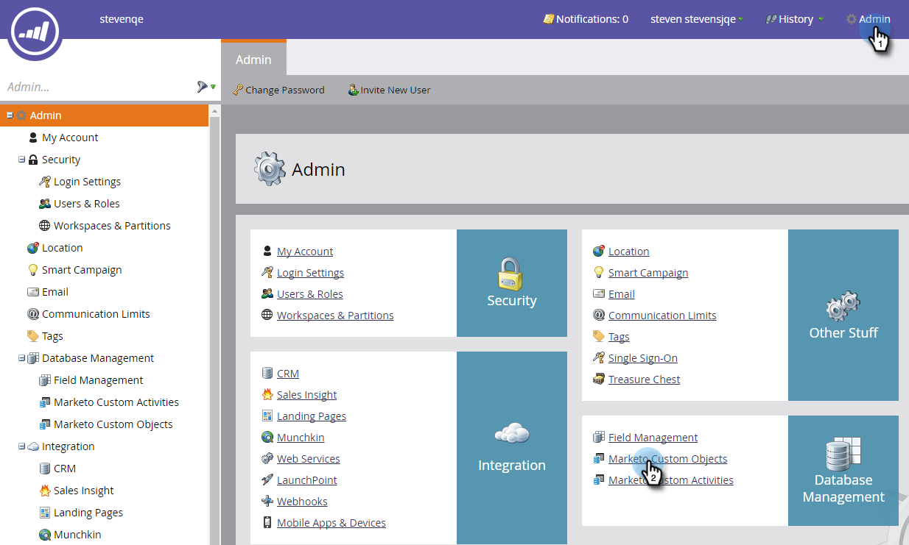

# Noções básicas sobre objetos personalizados do Marketo {#understanding-marketo-custom-objects}

Use objetos personalizados para rastrear métricas específicas para sua empresa.

>[!AVAILABILITY]
>
>Nem todos os usuários do Marketo Engage compraram essa funcionalidade. Entre em contato com a equipe de conta do Adobe (seu gerente de conta) para obter mais detalhes.

Use objetos personalizados como filtros e acionadores em suas campanhas inteligentes. Por exemplo:

* **Filtro**: enviar emails somente para proprietários de uma marca de veículo específica
* **Acionador**: enviar um email quando um objeto personalizado for adicionado a uma pessoa ou empresa.

Você pode configurar objetos personalizados em uma relação um para muitos ou muitos para muitos. Por exemplo:

* **De um para muitos**: uma pessoa possui vários carros
* **De muitos para muitos**: vários alunos estão inscritos em vários cursos de um catálogo de cursos

Uma estrutura de um para muitos usa um único campo de link para conectar o objeto personalizado a uma pessoa ou empresa.

Objetos personalizados muitos para muitos usam dois campos de link, parte de um objeto intermediário. Um campo Link é conectado à pessoa ou empresa e outro é conectado ao objeto personalizado, como o catálogo de cursos. Esse objeto intermediário pode conter campos personalizados adicionais, como uma nota de curso ou uma data de participação, o que define ainda mais a natureza da conexão.

>[!TIP]
>
>Importe objetos personalizados usando valores separados por vírgula (CSV) na interface do usuário para testar e validar uma amostra de dados. Em seguida, faça upload de todos os arquivos com uma API.

>[!CAUTION]
>
>Você não pode restaurar objetos personalizados, portanto, certifique-se de que não precisa mais deles antes de excluí-los.

## Acesso aos Objetos personalizados do Marketo {#accessing-marketo-custom-objects}

1. Vá para a área **[!UICONTROL Administrador]**.

   

1. Clique em **[!UICONTROL Objetos personalizados do Marketo]**.

   

1. A tela de Objetos personalizados do Marketo lista todos os objetos personalizados à direita, mas apenas os aprovados na grade principal.

   

   >[!NOTE]
   >
   >A grade exibe o nome do objeto, o número de registros, o número de campos e a data da atualização mais recente.

   >[!TIP]
   >
   >O Marketo atualiza esses campos automaticamente, mas você pode atualizar a exibição clicando no ícone na coluna Registros.

1. Clique no nome do objeto à direita para abrir a página de detalhes.

   

## Exibir Objetos Personalizados Associados a uma Pessoa {#view-custom-objects-associated-to-a-person}

Após criar a estrutura do objeto personalizado, ao fazer upload dos dados do objeto personalizado específicos, os objetos personalizados são associados automaticamente às pessoas no banco de dados usando o campo de link no objeto personalizado. Você pode exibir informações da guia [!UICONTROL Objetos Personalizados] na página de detalhes da pessoa.

1. Ir para **[!UICONTROL Banco de Dados]**.

   

1. Abra o banco de dados e clique na guia **[!UICONTROL Pessoas]**. Clique duas vezes no registro de uma pessoa associada a um objeto personalizado.

   

1. Na página de detalhes da pessoa, clique na guia **[!UICONTROL Objetos Personalizados]**. Selecione o objeto no menu suspenso.

   

1. Agora é possível exibir uma lista de todos os objetos personalizados desse tipo associados a essa pessoa.

   

## Uso de objetos personalizados com empresas {#using-custom-objects-with-companies}

Um objeto personalizado vinculado à empresa funciona melhor se você sincronizar empresas do CRM ou se você criar empresas explicitamente usando a API. Também recomendamos que você use a ID da empresa como o campo de link.

Se você tiver várias pessoas no Marketo que sejam registros no CRM ou em registros somente Marketo, um objeto personalizado vinculado a uma empresa não será associado a mais de um registro individual. Isso ocorre porque uma empresa com várias pessoas abaixo dele é compatível somente quando as empresas são sincronizadas do CRM ou se você usar uma API para criar empresas explicitamente.

Os objetos personalizados só podem ser vinculados diretamente a um único registro. Isso significa que quando seu tipo de objeto personalizado é vinculado pelo campo da empresa, você deve garantir que seus registros de pessoa estejam associados a uma empresa usando a conversão de contatos em seu CRM ou usando o campo externalCompanyId, se você gerenciar empresas usando as REST APIs da Marketo. Para registros de pessoas que não estão vinculados explicitamente a registros de empresas, os objetos personalizados vinculados usando empresa serão vinculados aleatoriamente a um único registro, mesmo se o valor do campo de empresa for compartilhado entre muitas pessoas.

Consulte [Importar dados de objetos personalizados](/help/marketo/product-docs/administration/marketo-custom-objects/import-custom-object-data.md) para obter mais informações.

>[!MORELIKETHIS]
>
>* [Criar objetos personalizados do Marketo](/help/marketo/product-docs/administration/marketo-custom-objects/create-marketo-custom-objects.md)
>* [Aprovar um Objeto Personalizado](/help/marketo/product-docs/administration/marketo-custom-objects/approve-a-custom-object.md)
>* [Editar e excluir um objeto personalizado do Marketo](/help/marketo/product-docs/administration/marketo-custom-objects/edit-and-delete-a-marketo-custom-object.md)
>* [Adicionar campos de objeto personalizado do Marketo](/help/marketo/product-docs/administration/marketo-custom-objects/add-marketo-custom-object-fields.md)
>* [Editar e excluir campos de objeto personalizado do Marketo](/help/marketo/product-docs/administration/marketo-custom-objects/edit-and-delete-marketo-custom-object-fields.md)
>* [Importar dados do objeto personalizado](/help/marketo/product-docs/administration/marketo-custom-objects/import-custom-object-data.md)
