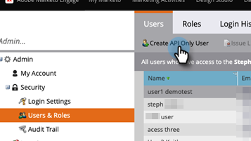

# Adicionar usuário somente de API para assinaturas habilitadas para o Adobe IMS {#add-api-only-user-for-adobe-ims-enabled-subscriptions}

Enquanto os usuários e administradores de marketing do Marketo Engage são gerenciados no Adobe Admin Console, somente a API do Marketo Engage deve ser criada e gerenciada no Marketo Engage.

As etapas abaixo descrevem como adicionar um usuário somente API no Marketo Engage. Antes de fazer isso, você deve ter [estabelecido uma Função Somente de API](/help/marketo/product-docs/administration/users-and-roles/create-an-api-only-user-role.md).

1. No Marketo, clique em **[!UICONTROL Administrador]** e selecione **[!UICONTROL Usuários e funções]**.

   

1. Clique em **[!UICONTROL Criar somente usuário da API]**.

   

1. Insira um [!UICONTROL Email], [!UICONTROL Nome] e [!UICONTROL Sobrenome] somente para o usuário da API. Selecione a Função [!UICONTROL Somente API] que deseja atribuir ao usuário. Clique em **[!UICONTROL Criar Somente API de Usuário]** quando terminar.

   

>[!NOTE]
>
>Quando a ação for bem-sucedida, o modal Criar API somente usuário será fechado e a lista Usuários será atualizada, e o novo usuário estará visível.
