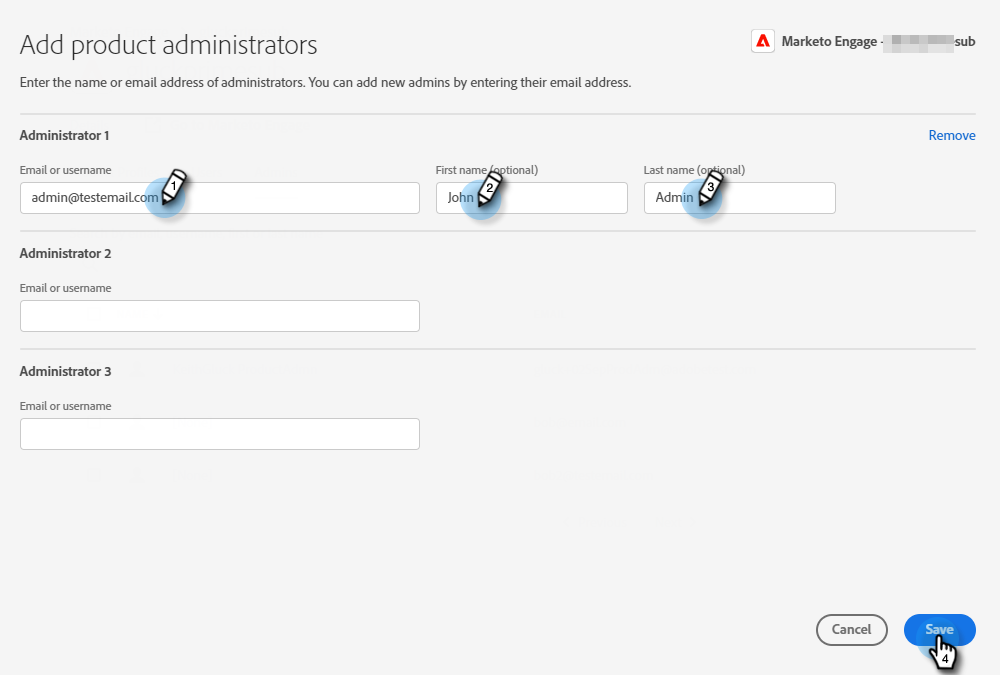
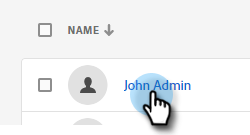
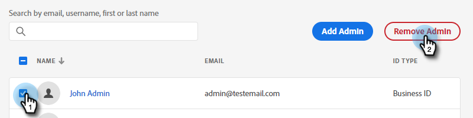

# Adicionar ou remover um administrador de produto {#add-or-remove-a-product-admin}

>[!NOTE]
>
>**Sistema** Os administradores só são criados no nível da Org do Adobe. Se você acha que precisa de mais de um, entre em contato com [Suporte Marketo](https://nation.marketo.com/t5/support/ct-p/Support).

## Adicionar um administrador de produto {#add-a-product-admin}

1. Faça logon no [Adobe Admin Console](https://adminconsole.adobe.com/).

   

1. Clique em **Marketo Engage**.

   

1. Selecione a subscrição desejada (caso tenha mais de uma).

   

1. Clique no botão **Administradores** guia .

   

1. Clique no botão **Adicionar administrador** botão.

   

1. Digite o endereço de email ou nome de usuário do Administrador que deseja adicionar. O nome e o sobrenome são opcionais. Clique em **Salvar**.

   

1. Clique no nome do Administrador que acabou de adicionar.

   

1. Em Produtos, clique no menu de três pontos e selecione **Editar**.

   

1. Clique no botão **+** sinal. Clique na divisa ao lado da assinatura de Marketo Engage desejada (se houver mais de uma) e selecione o perfil de produto desejado.

   

1. Clique em **Salvar**.

   

O usuário receberá dois emails. O primeiro e-mail notifica-os de que receberam direitos de administrador de produto para o Marketo Engage. O segundo email os convida a entrar no Marketo Engage.

>[!NOTE]
>
>Quando o usuário administrador do produto é adicionado ao Marketo Engage por meio da Adobe Admin Console, o usuário recebe a função de Administrador do produto do Adobe na assinatura.

## Remover um administrador {#remove-a-user}

1. Faça logon no [Adobe Admin Console](https://adminconsole.adobe.com/).

   

1. Clique em **Marketo Engage**.

   

1. Selecione a subscrição desejada (caso tenha mais de uma).

   

1. Clique no botão **Administradores** guia .

   

1. Selecione o Administrador que deseja remover e clique no botão **Remover administrador** botão.

   

1. Clique em **Remover administrador** para confirmar.

   

O usuário receberá um email notificando que não tem mais acesso de Administrador de produto ao Marketo Engage.
