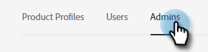

# Adicionar ou remover um administrador de produto {#add-or-remove-a-product-admin}

>[!NOTE]
>
>**Sistema** Os administradores são criados apenas no nível da Adobe Org. Se você precisar de mais de um, entre em contato com [Suporte ao Marketo](https://nation.marketo.com/t5/support/ct-p/Support).

## Adicionar um administrador de produto {#add-a-product-admin}

>[!IMPORTANT]
>
>É necessário adicionar um Administrador a um perfil de produto para obter acesso ao Marketo Engage.

1. Faça logon no [Adobe Admin Console](https://adminconsole.adobe.com/){target="_blank"}.

   

1. Clique em **Marketo Engage**.

   

1. Selecione a subscrição desejada (se tiver mais de uma).

   

1. Clique em **[!UICONTROL Administradores]** guia.

   

1. Clique em **[!UICONTROL Adicionar administrador]** botão.

   

1. Insira o endereço de email ou nome de usuário do Administrador que deseja adicionar. O nome e o sobrenome são opcionais. Clique em **[!UICONTROL Salvar]**.

   

1. Clique no nome do Administrador que acabou de adicionar.

   

1. Em Produtos, clique no menu de três pontos e selecione **[!UICONTROL Editar]**.

   

1. Clique em **+** assinatura. Clique na divisa ao lado da assinatura de Marketo Engage desejada (se houver mais de uma) e selecione o perfil de produto desejado.

   

1. Clique em **[!UICONTROL Salvar]**.

   

O usuário receberá dois emails. O primeiro email notifica que receberam direitos de administrador de produto no Marketo Engage. O segundo email os convida a entrar no Marketo Engage.

>[!NOTE]
>
>Quando o usuário administrador de produto é adicionado ao Marketo Engage por meio do Adobe Admin Console, o usuário recebe a função de Administrador de produto do Adobe na assinatura.

## Remover um administrador {#remove-a-user}

1. Faça logon no [Adobe Admin Console](https://adminconsole.adobe.com/){target="_blank"}.

   

1. Clique em **Marketo Engage**.

   

1. Selecione a subscrição desejada (se tiver mais de uma).

   

1. Clique em **[!UICONTROL Administradores]** guia.

   

1. Selecione o Administrador que deseja remover e clique no link **[!UICONTROL Remover administrador]** botão.

   

1. Clique em **[!UICONTROL Remover administrador]** para confirmar.

   

O usuário receberá um email notificando que não tem mais acesso de administrador de produto ao Marketo Engage.
