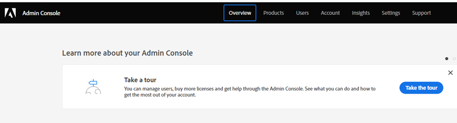
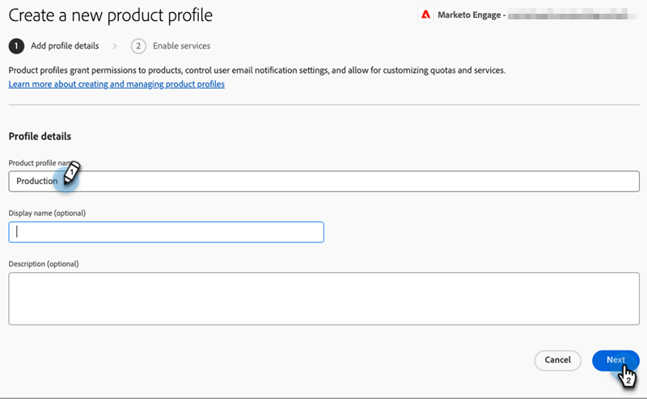

# Configuração de admin {#admin-setup}

Depois de ser adicionado como administrador do sistema da Adobe ao Marketo Engage em uma organização da Adobe, há algumas etapas que você precisará seguir para concluir a configuração inicial.

## Configuração inicial {#initial-setup}

1. Depois de ser adicionado como administrador do sistema designado para o Marketo Engage (em uma organização nova ou estabelecida), você receberá um email de boas-vindas. Nesse email, clique em **[!UICONTROL Introdução]**.

   

1. Se você tiver acessado anteriormente um aplicativo com uma Adobe ID, será direcionado diretamente para a Adobe Admin Console. Caso contrário, [configure seu Adobe ID](https://helpx.adobe.com/manage-account/using/create-update-adobe-id.html){target="_blank"}.

   

## Criar um perfil do produto {#create-a-product-profile}

Depois que o administrador do sistema acessar o Admin Console, é hora de criar um perfil de produto. É assim que seus usuários/administradores obtêm acesso ao Marketo Engage.

1. Na página **[!UICONTROL Visão geral]**, em **[!UICONTROL Produtos e serviços]**, clique em **Marketo Engage**.

   

1. Escolha a subscrição desejada. Se você tiver apenas um, pule para a próxima etapa.

   

   >[!NOTE]
   >
   >Se você tiver várias assinaturas, essas etapas deverão ser seguidas para cada uma.

1. Clique no botão **[!UICONTROL Novo Perfil]**.

   

1. Dê um nome ao Perfil de Produto (o Nome para Exibição e a Descrição são opcionais) e clique em **[!UICONTROL Avançar]**.

   

1. Nenhum serviço precisa ser selecionado. Clique em **[!UICONTROL Salvar]**.

>[!NOTE]
>
>Se você configurar vários perfis de produto, os usuários terão o mesmo acesso ao Marketo, independentemente do perfil ao qual foram adicionados.

>[!MORELIKETHIS]
>
>[Adicionar ou remover um administrador de produto](/help/marketo/product-docs/administration/marketo-with-adobe-identity/add-or-remove-a-product-admin.md){target="_blank"}
