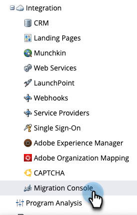
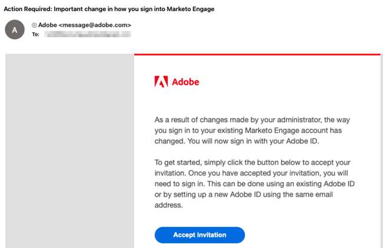
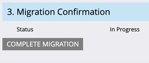

# Migrar para a identidade do Adobe {#migrating-to-adobe-identity}

Quando o Adobe agendará a migração de usuário de uma assinatura, os administradores de produtos do Marketo Engage terão acesso ao Console de migração, que pode ser encontrado no menu de navegação na área Administrador em Integração.

## Pré-migração {#pre-migration}

Antes de começar a migração, um Administrador pode modificar a data de início da migração do usuário para sua assinatura navegando até a tela Pré-migração no Console de migração. Para alterar a data, o administrador pode clicar no link **Editar** botão.

O administrador pode escolher uma data entre 8 e 30 dias no futuro. Quando uma data for selecionada, o administrador deverá clicar em **Salvar** para fazer a alteração.

>[!NOTE]
>
>Para solicitar uma data anterior a 8 dias ou posterior a 30, ou se precisar ajustar a data após o bloqueio do console de pré-migração, envie um email para `marketocares@marketo.com`.

## Migrações para a identidade do Adobe {#migrations-to-adobe-identity}

Todas as assinaturas do Marketo com fuso horário dos EUA serão migradas a partir da meia-noite, hora padrão do Pacífico, da data de início da migração do usuário. A migração de usuário para todas as outras assinaturas começará à meia-noite do fuso horário especificado da assinatura. Quando a migração de usuário de uma assinatura for iniciada, o gerenciamento de usuários não estará mais disponível na área de administração do Marketo e só será obtido na Adobe Admin Console. O gerenciamento de funções permanece na guia Usuários e funções na área de Administração do Marketo, bem como no gerenciamento de usuários local (somente API).

O Adobe migrará automaticamente todos os administradores do Marketo com emails verificados primeiro. Quando os administradores do Marketo migrarem para a Identidade do Adobe, eles serão adicionados ao Adobe Admin Console como administrador de produto da assinatura do Marketo e receberão a função de administrador de produto do Adobe no aplicativo do Marketo (juntamente com quaisquer outras funções que tenham tido anteriormente) e terão seu Adobe ID qualificado para a assinatura. Os administradores receberão dois emails. Um indicando que foi atribuído como um Administrador de produto Adobe e o outro indicando que o Adobe ID tem direito ao produto Marketo.

**E-mail do administrador do produto Marketo**

**Email de direito do Marketo**

**Se sua assinatura do Marketo tiver menos de 75 usuários e não tiver SSO no Marketo e/ou em sua Adobe Org**, o Adobe migrará automaticamente o restante dos usuários. Esse fluxo de trabalho tem como objetivo fornecer o mais alto nível de automação e nenhuma ação é necessária para executar a migração. Após a conclusão da migração, o Console de migração do Marketo não aparecerá mais na área de navegação do administrador do Marketo e todos os usuários acessarão o Marketo usando uma Adobe ID.

**Se sua assinatura do Marketo tiver 75 ou mais usuários ou tiver SSO no Marketo e/ou em sua Adobe Org**, os Administradores de produtos da Marketo terão acesso à ferramenta de Migração de usuários de autoatendimento do Console de Migração após o início da migração e serão avisados por meio de um banner após fazer logon na página Meu Marketo. O administrador será responsável por concluir a migração de usuário usando a ferramenta Migração de Usuário de Autoatendimento.

## Migração de usuários de autoatendimento do Marketo {#marketo-self-service-user-migration}

A ferramenta Console de Migração de Usuários Self-Service do Marketo consiste em duas guias.

* **Guia Status da migração**
* **Guia Migração de usuários**

### Guia Status da migração {#migration-status-tab}

A guia Status da migração fornece métricas gerais sobre o progresso do pré-requisito de verificação de email dos usuários, migração e ativação dos usuários e conclusão da migração da assinatura.

Na parte superior do Status de migração, a expiração da migração da assinatura e o botão para estender a expiração são exibidos. Mais informações sobre a expiração da migração podem ser encontradas no [Seção Expiração da migração de usuário](#user-migration-expiration).

Na próxima seção da guia Status da migração, há duas barras de andamento. A primeira barra de progresso é mostrar o progresso da conclusão da verificação de email do usuário. A segunda barra de progresso mostra a progressão da conclusão da migração do usuário.

Em seguida, há três seções do Status exibidas para o administrador.

* **Verificação de email do usuário**: status de verificação dos usuários na assinatura.
* **Migração e ativação de usuários**: migração e ativação do usuário (migração e direito ao produto Marketo Engage) status dos usuários na assinatura.
* **Confirmação de migração**: status de conclusão da migração da assinatura.

#### Verificação de email do usuário {#user-email-verification}

Na seção Verificação de email do usuário, um administrador pode encontrar o status atual da verificação de email para os usuários na assinatura, antes da migração para a Identidade do Adobe.

Um administrador pode exibir o status de verificação de email da assinatura, a porcentagem de usuários na assinatura que concluíram a verificação de email e o número de usuários que foram marcados como ignorados. O status será relatado com base no status do estado de verificação de email de todos os usuários na assinatura. O administrador pode clicar no número de usuários ignorados e navegará até a guia Migração de usuários para exibir esses usuários.

O email de verificação pode ser reenviado por um administrador na guia Migração de usuários do Console de migração e na guia Usuário e funções na área Administrador do Marketo, ou pelo usuário em suas Configurações da conta. Como emails de convite de usuário, o link no email de verificação expira em 3 dias. Mais informações sobre verificação de email podem ser encontradas no [Comunidade](https://nation.marketo.com/) e no [documentação de verificação de email](/help/marketo/product-docs/administration/users-and-roles/email-verification.md).

>[!IMPORTANT]
>
>Se um usuário do Marketo Engage não verificar seu endereço de email, ele não poderá ser migrado para uma Adobe ID e perderá o acesso à assinatura do Marketo após a conclusão da migração. Para recuperar o acesso, um administrador de produto do Marketo precisaria adicioná-los como um novo usuário.

#### Migração e ativação de usuários {#user-migration-and-activation}

Na seção Migração e ativação de usuários, um Administrador pode encontrar o status atual do total de migrações de usuários e os direitos ao Sistema Adobe Identity Management.

Um administrador pode exibir a porcentagem de usuários em sua assinatura que foram migrados para uma Adobe ID ou marcados como Ignorados. O status será relatado com base no status do estado de migração de todos os usuários para uma Adobe ID na assinatura, ou marcado como Ignorado e não será migrado. À medida que os usuários são migrados e têm direito ao Marketo Engage, ou são ignorados, esse status é atualizado.

#### Confirmação de migração {#migration-confirmation}

Na seção Confirmação de Migração, um administrador precisará confirmar se a migração de usuário foi concluída para a assinatura.

Depois que todos os usuários na assinatura forem considerados (migrados ou ignorados), o botão para &quot;Migração concluída&quot; será exibido.

O administrador que realiza a migração precisará concluir a confirmação da migração clicando no link **Migração concluída** botão. Eles serão solicitados a **Confirmar o**.

Depois que a conclusão da migração do usuário for confirmada, o Console de migração será removido do menu de navegação Admin.

### Expiração da migração do usuário {#user-migration-expiration}

O Adobe exige que os clientes concluam as migrações de autoatendimento em 30 dias. Os administradores não serão impedidos de migrar usuários ou concluir a migração se a data de expiração tiver passado. No entanto, eles só poderão migrar usuários sob demanda. Se um administrador precisar de mais tempo, ele poderá estender a data de expiração da assinatura.

Ao clicar no link **Estender expiração** , a data será atualizada para uma semana depois. Um administrador pode estender a expiração até três vezes.

O Adobe será executado se você não concluir a migração até a data de expiração.

### Guia Migração de usuários {#user-migration-tab}

A guia Migração de usuários fornece aos administradores as ferramentas para ter controle total da migração de usuários.

Os administradores têm a opção de:

* Acione emails de verificação para usuários não verificados por meio do botão &quot;Verificar email&quot;
* Ignorar migração de usuário para usuários que o administrador sabe que não podem ou não verificarão seus emails ou que não devem ser migrados por meio do botão &quot;Ignorar migração&quot;
* Migrar usuários selecionados por demanda através do botão &#39;Migrar Agora&#39;
* Programar migração de usuário para usuários selecionados por uma data específica por meio do botão &quot;Programar migração&quot;
* Migrar todos os usuários qualificados sob demanda (nenhuma seleção de usuário é necessária) por meio do botão &quot;Migrar todos os usuários&quot;

**Verificar email**

A verificação de e-mail é necessária para que um usuário seja migrado para uma Adobe ID. Se houver usuários que não verificaram seu endereço de email e precisam ser migrados, o administrador poderá acionar o email de verificação para ser enviado novamente ao usuário. Ao selecionar um usuário não verificado, o botão &quot;Verificar email&quot; se tornará clicável.

Quando o administrador clicar no botão **Verificar email** eles receberão uma notificação de que o email foi enviado.

**Ignorar e não ignorar a migração de usuários**

Durante a migração do usuário, todos os usuários precisam ser migrados ou ignorados. O Adobe exige que os administradores reconheçam que um usuário não será migrado e que um administrador precise marcar o usuário como ignorado. Caso contrário, o administrador não poderá confirmar a conclusão da migração do usuário. Todos os usuários ignorados perderão o acesso ao Marketo após a conclusão da migração.

>[!IMPORTANT]
>
>Um administrador deve ignorar todos os usuários com emails não verificados. Se houver usuários que verificaram seus emails, mas o administrador não quiser migrá-los por algum motivo, eles deverão marcá-los como ignorados.

Para ignorar um usuário, o administrador pode selecionar os usuários desejados. O botão &quot;Ignorar migração&quot; se tornará clicável. Ao clicar no link **Ignorar migração** , a página será atualizada e o status de verificação e o status de migração do usuário selecionado serão atualizados para &quot;Ignorados&quot;.

Um administrador pode não ignorar um usuário ignorado anteriormente, se for determinado que o usuário precisa ser migrado.

Para não ignorar um usuário, o administrador pode selecionar o usuário desejado. O botão &quot;Cancelar migração&quot; se tornará clicável. Ao clicar no link **Não ignorar migração** , a página será atualizada.  O status de verificação do usuário selecionado será atualizado para seu status atual, &quot;Verificado&quot; ou &quot;Não verificado&quot;, e o status de migração do usuário será atualizado para &quot;Não iniciado&quot;.

>[!NOTE]
>
>O botão &quot;Cancelar migração&quot; só estará ativo se todos os usuários selecionados tiverem um Status de migração &quot;Ignorado&quot;.

### Migração de usuários do Marketo para IDs do Adobe {#migrating-marketo-users-to-adobe-ids}

Os administradores de produtos da Marketo poderão selecionar usuários para migrar em lotes ou todos os usuários qualificados ao mesmo tempo. Depois que os usuários são selecionados, os administradores têm a opção de &quot;Migrar agora&quot; ou &quot;Agendar migração&quot; para uma data posterior, proporcionando aos administradores flexibilidade e controle sobre quais usuários são migrados e quando. Os administradores também têm a opção de &quot;Migrar todos os usuários&quot; em uma assinatura.

Por exemplo, um administrador pode selecionar um grupo de &quot;usuários avançados&quot; para os quais deseja migrar primeiro. Depois que essas migrações de usuários forem concluídas com êxito, eles poderão selecionar diferentes grupos de usuários com base em variáveis como espaço de trabalho/negócios ou função/função para realizar mais migrações de usuários em lote pelo. Ou podem decidir migrar o restante dos usuários nas assinaturas após o sucesso do primeiro lote. O objetivo é fornecer a maior flexibilidade na distribuição de IDs de Adobe para os usuários.

Todas as migrações de usuários ocorrem simultaneamente e devem ser concluídas com êxito em sessenta segundos. Enquanto a migração de usuário está ocorrendo para um usuário específico, ele pode perder o acesso por até 1 minuto, e isso somente se o usuário estiver conectado ao aplicativo. Após a conclusão da migração do usuário, ele receberá um email sobre como fazer logon no Marketo Engage com uma identidade Adobe. O usuário precisa aceitar o convite através do link do botão no email. Depois de aceitar o convite, o usuário deve fazer logon com uma Adobe ID. Instruções sobre como fazer logon no Marketo Engage com uma Adobe ID [pode ser encontrado aqui](/help/marketo/product-docs/administration/marketo-with-adobe-identity/user-sign-in-with-adobe-id.md).

As migrações de usuários são processadas de maneira independente, portanto, se uma migração falhar, o Adobe continuará a processar outras migrações de usuários. Se ocorrer uma falha de migração do usuário, nenhuma ação será exigida por um administrador. O administrador receberá uma notificação por e-mail sobre o erro e será alertado de que o Adobe está funcionando para resolver o problema imediatamente. Se a migração de um usuário falhar e ele for conectado ao Marketo Engage, o usuário poderá perder o acesso por até dois minutos enquanto ocorrerem novas tentativas de migração. Se a migração de um usuário falhar, ele poderá continuar a acessar o Marketo Engage com sua identidade da Marketo até receber uma notificação por email informando que a migração foi bem-sucedida e ser convidado a entrar com uma Adobe ID.

**Migrar agora**

Um administrador pode selecionar um ou mais usuários para migrar sob demanda. Isso acionará a migração dos usuários imediatamente. Para migrar um ou mais usuários, o administrador pode selecionar o(s) usuário(s) desejado(s) e o botão &#39;Migrar agora&#39; se tornará clicável.

>[!NOTE]
>
>O botão &quot;Migrar agora&quot; só estará ativo se todos os usuários selecionados tiverem um Status de verificação &quot;Verificado&quot;.

Ao clicar no link **Migrar agora** , o administrador será solicitado a confirmar a migração dos usuários selecionados. Depois que o administrador confirmar, as migrações de usuário começarão a ser processadas o mais rápido possível.

**Agendar migração**

Um administrador pode selecionar um ou mais usuários para agendar a migração em uma data posterior. Para agendar a migração para um ou mais usuários, o administrador seleciona o(s) usuário(s) desejado(s) e o botão &#39;Agendar migração&#39; ficará clicável.

>[!NOTE]
>
>O botão &quot;Agendar migração&quot; só estará ativo se todos os usuários selecionados tiverem o Status de verificação &quot;Verificado&quot;.

Ao clicar no link **Agendar migração** , o administrador será solicitado a selecionar a data de migração desejada do(s) usuário(s) selecionado(s). O administrador só pode selecionar datas anteriores à data de expiração da migração da assinatura. Quando o administrador confirmar, as migrações de usuário serão agendadas para iniciar o processamento na data selecionada.

>[!NOTE]
>
>Todas as assinaturas do Marketo com fuso horário dos EUA serão migradas a partir da meia-noite, hora padrão do Pacífico, da data de início da migração. A migração de usuário para todas as outras assinaturas começará à meia-noite do fuso horário especificado da assinatura.

**Migrar todos os usuários**

Um administrador pode optar por migrar todos os usuários qualificados em uma assinatura, a qualquer momento. Isso acionará a migração dos usuários qualificados imediatamente. Usuários qualificados são usuários com emails verificados que ainda não foram migrados.

Ao clicar no link **Migrar todos os usuários** , o administrador será solicitado a **Confirmar o** migração de todos os usuários qualificados. Quando o administrador confirmar, as migrações de usuário começarão a ser processadas o mais rápido possível.

