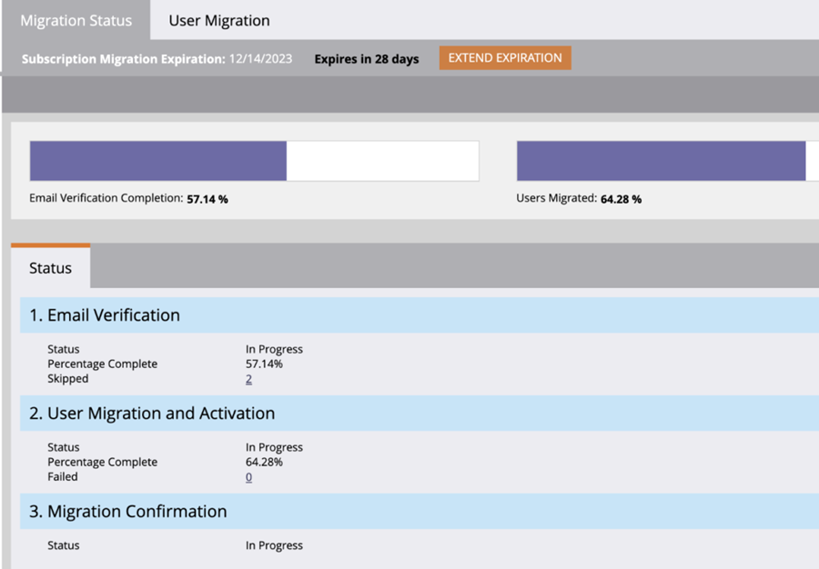
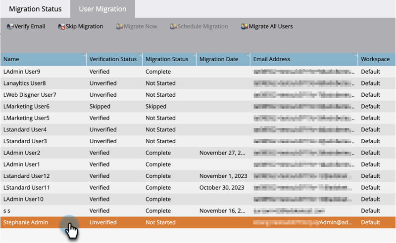

# Migração para a identidade da Adobe {#migrating-to-adobe-identity}

Quando a Adobe agenda a migração de usuários de uma assinatura, os administradores do produto Marketo Engage terão acesso ao Console de migração, que pode ser encontrado no menu de navegação na área de Administração, em Integração.

## Pré-migração {#pre-migration}

Antes de começar a migração, o Administrador pode modificar a data inicial da migração do usuário para sua assinatura navegando até a tela Pré-migração no console de migração. Para alterar a data, o administrador pode clicar no botão **Editar**.

O administrador pode escolher uma data entre 8 e 30 dias no futuro. Quando uma data for selecionada, o administrador deverá clicar em **Salvar** para fazer a alteração.

>[!NOTE]
>
>Para solicitar uma data anterior a 8 dias ou posterior a 30, ou se precisar ajustar a data após o bloqueio do console de pré-migração, envie um email para `marketocares@marketo.com`.

## Migrações para a identidade da Adobe {#migrations-to-adobe-identity}

Todas as assinaturas do Marketo com fuso horário dos EUA serão migradas a partir da meia-noite, horário padrão do Pacífico, da data de início da migração do usuário. A migração de usuário para todas as outras assinaturas começará à meia-noite do fuso horário especificado da assinatura. Quando a migração de usuários de uma assinatura for iniciada, o gerenciamento de usuários não estará mais disponível na área de Administração do Marketo e será realizado somente no Adobe Admin Console. O gerenciamento de funções permanece na guia Usuários e funções na área de Administração do Marketo, bem como no gerenciamento de usuários local (somente API).

A Adobe migrará automaticamente todos os administradores do Marketo (com uma função padrão de administrador) com emails verificados primeiro. Quando os administradores do Marketo migrarem para a identidade da Adobe, eles serão adicionados ao Adobe Admin Console como administrador de produto da assinatura do Marketo e receberão a função de administrador de produto da Adobe no aplicativo do Marketo (juntamente com quaisquer outras funções que estavam cumprindo) e terão sua Adobe ID qualificada para a assinatura. Os administradores receberão dois emails. Um indicando que foi atribuído como Administrador de produto do Admin Console e o outro indicando que a Adobe ID recebeu acesso ao Marketo.

>[!IMPORTANT]
>
>Você deve clicar no botão **Aceitar convite** no email de concessão de acesso para poder acessar o Marketo Engage com a Adobe ID.

**Email do administrador do produto Marketo**

**Email de concessão de acesso ao Marketo**

**Se a sua assinatura do Marketo não tiver SSO no Marketo e/ou na sua Organização da Adobe**, a Adobe migrará automaticamente o restante dos usuários. Esse fluxo de trabalho tem como objetivo fornecer o mais alto nível de automação e nenhuma ação é necessária para executar a migração. Após a conclusão da migração, o console de migração do Marketo não aparecerá mais na área de navegação do administrador do Marketo e todos os usuários acessarão o Marketo usando uma Adobe ID.

**Se sua assinatura do Marketo tiver SSO no Marketo e/ou na sua organização da Adobe**, os administradores do Marketo terão acesso à ferramenta de migração de usuários por autoatendimento do console de migração após o início da migração do usuário e serão alertados por meio de um banner após fazerem logon na página Meu Marketo. O administrador será responsável por concluir a migração do usuário usando a ferramenta de migração de usuários por autoatendimento.

## Migração de usuários por autoatendimento do Marketo {#marketo-self-service-user-migration}

A ferramenta Console de migração de usuários por autoatendimento do Marketo consiste em duas guias.

* **Guia Status da migração**
* **Guia Migração do usuário**

São necessárias 3 etapas principais para concluir uma migração por autoatendimento.

1. Migrar todos os usuários elegíveis com o endereço de email verificado desejado (guia Migração de usuário)
1. Ignorar todos os usuários inelegíveis e todos os usuários elegíveis indesejados (guia Migração de usuário)
1. Após concluir as etapas 1 e 2, finalize a confirmação da migração (guia Status da migração).

### Guia Status da migração {#migration-status-tab}

A guia Status da migração fornece métricas gerais sobre o progresso do pré-requisito de verificação de email dos usuários, migração e ativação dos usuários e conclusão da migração da assinatura.

Na parte superior do Status da migração, a expiração da migração da assinatura e o botão para estender a expiração são exibidos. Mais informações sobre a expiração da migração podem ser encontradas na [seção Expiração da migração do usuário](#user-migration-expiration).

Na próxima seção da guia Status da migração, há duas barras de progresso. A primeira barra mostra o progresso da conclusão da verificação de email do usuário. A segunda barra mostra a progressão da conclusão da migração do usuário.

Em seguida, há três seções de status exibidas para o administrador.

* **Verificação de email de usuário**: status da verificação dos usuários na assinatura.
* **Migração e ativação do usuário**: status da migração e ativação (migração e concessão de acesso ao Marketo Engage) dos usuários na assinatura.
* **Confirmação da migração**: status da conclusão da migração da assinatura.

#### Verificação de email do usuário {#user-email-verification}

Na seção Verificação de email de usuário, o administrador pode encontrar o status atual da verificação de email dos usuários na assinatura, antes da migração para a identidade da Adobe.

O administrador pode visualizar o status da verificação de email da assinatura, a porcentagem de usuários na assinatura que concluíram a verificação de email e o número de usuários que foram marcados como ignorados. O status será relatado com base no status do estado de verificação de email de todos os usuários na assinatura. O administrador pode clicar no número de usuários ignorados e será levado até a guia Migração de usuários para visualizar esses usuários.

O email de verificação pode ser reenviado por um administrador na guia “Migração de usuários” do console de migração e na guia “Usuários e funções” na área do administrador do Marketo, ou pelo usuário nas configurações de sua conta. Como ocorre com os emails de convite de usuário, o link no email de verificação vence em três dias. Mais informações sobre a verificação de emails podem ser encontradas na [Comunidade](https://nation.marketo.com/) e na [documentação de verificação de emails](/help/marketo/product-docs/administration/users-and-roles/email-verification.md).

>[!IMPORTANT]
>
>Se um usuário do Marketo Engage não verificar seu endereço de email, não poderá migrar para uma Adobe ID e perderá o acesso à assinatura do Marketo após a conclusão da migração. Para recuperar o acesso, um administrador de produtos do Marketo precisaria adicioná-los como um novo usuário.

#### Migração e ativação de usuários {#user-migration-and-activation}

Na seção “Migração e ativação de usuários”, um administrador pode encontrar o status atual do total de migrações de usuários e os direitos ao Adobe Identity Management System.

Um administrador pode exibir a porcentagem de usuários em sua assinatura que foram migrados para uma Adobe ID ou marcados como ignorados. O status é relatado com base no estado de migração de todos os usuários para uma Adobe ID na assinatura, ou marcado como ignorado sem ser migrado. À medida que os usuários são migrados e autorizados a usar o Marketo Engage, ou ignorados, esse status é atualizado.

#### Confirmação da migração {#migration-confirmation}

Na seção “Confirmação da migração”, um administrador precisa confirmar se a migração de usuários foi concluída para a assinatura.

Depois que todos os usuários da assinatura são considerados (migrados ou ignorados), o botão de “Concluir migração” é exibido.

O administrador que conduz a migração precisa concluir a confirmação da migração, clicando no botão **Concluir migração**. Em seguida, precisa clicar em **Confirmar**.

Depois que a conclusão da migração de usuários é confirmada, o console de migração é removido do menu de navegação do administrador.

### Vencimento da migração de usuários {#user-migration-expiration}

A Adobe exige que os clientes concluam as migrações de autoatendimento em 30 dias. Os administradores não são impedidos de migrar usuários ou concluir a migração após a data de vencimento. No entanto, eles só podem migrar usuários sob demanda. Se um administrador precisar de mais tempo, ele pode estender a data de vencimento da assinatura.

Ao se clicar no botão **Estender vencimento**, a data é atualizada para uma semana depois. Um administrador pode estender o vencimento até três vezes.

A Adobe entrará em contato se você não concluir a migração até a data de vencimento.

### Guia “Migração de usuários” {#user-migration-tab}

A guia “Migração de usuários” fornece aos administradores as ferramentas para ter controle total sobre a migração de usuários.

Os administradores têm a opção de:

* Acionar emails de verificação para usuários não verificados por meio do botão “Verificar email”
* Ignorar a migração de usuários que o administrador sabe que não podem verificar ou não vão verificar seus emails, ou que não devem ser migrados por meio do botão “Ignorar migração”
* Migrar os usuários selecionados por demanda por meio do botão “Migrar agora”
* Programar migração dos usuários selecionados para uma data específica por meio do botão “Programar migração”
* Migrar todos os usuários elegíveis sob demanda (não é necessário selecionar os usuários) por meio do botão “Migrar todos os usuários”

**Verificar email**

A verificação de email é necessária para que um usuário seja migrado para uma Adobe ID. Se houver usuários que não verificaram seu endereço de email e precisam ser migrados, o administrador pode reenviar o email de verificação. Se um usuário não verificado for selecionado, o botão “Verificar email” fica clicável.

Quando o administrador clicar no botão **Verificar email**, ele receberá uma notificação de que o email foi enviado.

**Ignorar e deixar de ignorar a migração de usuários**

Durante a migração de usuários, todos os usuários precisam ser migrados ou ignorados. A Adobe exige que os administradores reconheçam que um usuário não será migrado e que precisam marcá-lo como ignorado. Caso contrário, o administrador não poderá confirmar a conclusão da migração de usuários. Todos os usuários ignorados perderão o acesso ao Marketo após a conclusão da migração.

>[!IMPORTANT]
>
>Um administrador precisa ignorar todos os usuários com emails não verificados. Se houver usuários que verificaram seus emails, mas o administrador não os quiser migrar por algum motivo, eles deverão ser marcados como ignorados.

Para ignorar usuários, o administrador pode selecionar os usuários desejados. O botão “Ignorar migração” ficará clicável. Ao clicar no botão **Ignorar migração**, a página será atualizada, e o status de verificação e de migração do usuário selecionado será atualizado para “Ignorado”.

Se o administrador mudar de ideia e decidir que um usuário ignorado precisa ser migrado, ele pode deixar de ignorá-lo.

Para deixar de ignorar um usuário, o administrador pode selecioná-lo. O botão “Deixar de ignorar migração” ficará clicável. Ao clicar no botão **Deixar de ignorar migração**, a página será atualizada.  O status de verificação do usuário selecionado será atualizado para seu status atual, “Verificado” ou “Não verificado”, e o status da migração de usuários será atualizado para “Não iniciada”.

>[!NOTE]
>
>O botão “Deixar de ignorar migração” só estará ativo se todos os usuários selecionados tiverem o status de migração “Ignorado”.

### Migrar usuários do Marketo para Adobe IDs {#migrating-marketo-users-to-adobe-ids}

Os administradores de produtos do Marketo poderão selecionar usuários para migrar em lotes ou todos os usuários elegíveis ao mesmo tempo. Depois que os usuários são selecionados, os administradores têm a opção de “Migrar agora” ou “Programar migração” para uma data posterior, proporcionando flexibilidade e controle sobre quais usuários são migrados e quando. Os administradores também têm a opção de “Migrar todos os usuários” de uma assinatura.

Por exemplo, um administrador pode selecionar um grupo de “usuários avançados” que deseja migrar primeiro. Depois que essas migrações de usuários forem concluídas com sucesso, eles poderão selecionar diferentes grupos de usuários com base em variáveis como espaço de trabalho/empresa ou função/cargo para realizar mais migrações de usuários em lotes. Ou podem decidir migrar o restante dos usuários das assinaturas após o sucesso do primeiro lote. O objetivo é fornecer o máximo de flexibilidade na distribuição de Adobe IDs aos usuários.

Todas as migrações de usuários ocorrem simultaneamente e devem ser concluídas com sucesso em 60 segundos. Enquanto a migração de usuários estiver ocorrendo para um usuário específico, ele poderá perder o acesso por até um minuto, e isso somente se estiver conectado ao aplicativo. Após a conclusão da migração, o usuário receberá um email sobre como fazer logon no Marketo Engage com uma identidade da Adobe. O usuário precisa aceitar o convite por meio do link no email _antes_ de poder fazer logon com uma Adobe ID. As instruções sobre como fazer logon no Marketo Engage com uma Adobe ID [podem ser encontradas aqui](/help/marketo/product-docs/administration/marketo-with-adobe-identity/user-sign-in-with-adobe-id.md).

As migrações de usuários são processadas de maneira independente; portanto, se uma migração falhar, a Adobe continuará processando outras migrações de usuários. Se ocorrer uma falha na migração de usuários, nenhuma ação será exigida por parte de um administrador. O administrador receberá uma notificação por email sobre o erro e será alertado de que a Adobe está trabalhando para resolver o problema imediatamente. Se a migração de um usuário falhar e ele estiver conectado ao Marketo Engage, ele poderá perder o acesso por até dois minutos, enquanto novas tentativas de migração são realizadas. Se a migração de um usuário falhar, ele poderá continuar acessando o Marketo Engage com sua identidade do Marketo até receber uma notificação por email de que a migração foi bem-sucedida e ser convidado a fazer logon com uma Adobe ID.

**Migrar agora**

Um administrador pode selecionar um ou mais usuários para migrar sob demanda. Isso acionará a migração dos usuários imediatamente. Para migrar um ou mais usuários, o administrador pode selecioná-los, e o botão “Migrar agora” ficará clicável.

>[!NOTE]
>
>O botão “Migrar agora” só estará ativo se todos os usuários selecionados tiverem o status de verificação “Verificado”.

Ao clicar no botão **Migrar agora**, o administrador terá que confirmar a migração dos usuários selecionados. Depois que confirmar, as migrações de usuários começarão a ser processadas o mais rapidamente possível.

**Programar migração**

Um administrador pode selecionar um ou mais usuários para programar a migração para uma data posterior. Para programar a migração de um ou mais usuários, o administrador os seleciona e o botão “Programar migração” ficará clicável.

>[!NOTE]
>
>O botão “Migração programada” só estará ativo se todos os usuários tiverem o status de verificação “Verificado” e o status de migração “Não iniciada” ou “Adobe ID criada”.

Ao clicar no botão **Programar migração**, o administrador terá que selecionar a data de migração desejada para os usuários selecionados. O administrador só pode selecionar datas anteriores à data de vencimento da migração da assinatura. Quando o administrador confirmar, as migrações de usuários serão programadas para iniciar o processamento na data selecionada.

>[!NOTE]
>
>Todas as assinaturas do Marketo com fuso horário dos EUA serão migradas a partir de meia-noite, horário padrão do Pacífico, da data inicial da migração. A migração de usuários para todas as outras assinaturas começará à meia-noite do fuso horário especificado da assinatura.

**Migrar todos os usuários**

Um administrador pode optar por migrar todos os usuários qualificados de uma assinatura a qualquer momento. Isso acionará a migração dos usuários elegíveis imediatamente. Usuários elegíveis são usuários com emails verificados que ainda não foram migrados.

Ao clicar no botão **Migrar todos os usuários**, o administrador terá que **Confirmar** a migração de todos os usuários elegíveis. Quando o administrador confirmar, as migrações de usuários começarão a ser processadas o mais rapidamente possível.

