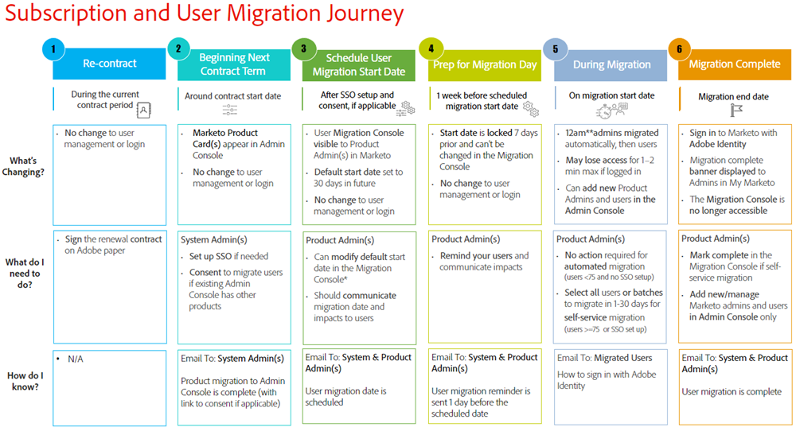

# Noções básicas da assinatura do Marketo e a migração de usuários para o Adobe Admin Console {#understanding-marketo-subscription-and-user-migration-to-the-adobe-admin-console}

A Adobe está aprimorando a forma de gerenciar as assinaturas e os usuários do Adobe Marketo Engage, aumentando a produtividade para você e para a sua organização. Como parte dessa alteração, a Adobe está migrando as suas assinaturas e usuários do Marketo Engage para a Adobe Admin Console. Essa é uma migração necessária e não afetará nenhum fluxo de trabalho de marketing, conteúdo, integrações ou ativos.

>[!TIP]
>
>Saiba como você pode usar o Adobe Admin Console para gerenciar os seus direitos da Adobe em toda a organização com o [Guia do administrador para empresas e equipes](https://helpx.adobe.com/br/enterprise/admin-guide.html){target="_blank"}.

## O que está mudando? {#what-is-changing}

Como parte da migração, o seu gerenciamento de assinaturas e usuários passará do aplicativo do Marketo para o Adobe Admin Console.

* **Os administradores do sistema gerenciarão as assinaturas no Adobe Admin Console**. Veja todos os seus produtos da Adobe no mesmo console.

* **Os administradores de produtos gerenciarão os usuários e seus acessos no Adobe Admin Console**. Adicione e remova usuários para todas as suas assinaturas da Adobe. A Adobe Admin Console não é compatível com vencimento de acessos com base no usuário. Os usuários que tiverem acesso ao Marketo Engage programado para vencer após a migração serão migrados mesmo assim e receberão acesso sem vencimento. Após a migração, eles precisarão ser removidos manualmente na (ou antes da) data de vencimento desejada.

* **Os usuários farão logon com a identidade da Adobe**. A Adobe migrará os usuários existentes para o Adobe Admin Console. Os usuários farão logon em suas assinaturas do Marketo com suas novas identidades da Adobe, seja uma Adobe ID ou uma Adobe Federated ID (SSO).

* **Os URLs ficarão diferentes após a migração**. O Marketo Engage deixará de ser distribuído pelo site experience.adobe.com e passará para a Adobe Experience Cloud, e os URLs estarão no seguinte formato: `https://experience.adobe.com/#/@tenantID/so:XXX-XXX-XXX/marketo-engage/classic/` (os XXXs representam o Munchkin ID, e o @tenantID é o da sua organização da Adobe). Você precisa colaborar com a sua equipe de TI para incluir na lista de permissões todos os domínios da Adobe listados [na parte superior deste artigo](/help/marketo/getting-started/initial-setup/configure-protocols-for-marketo.md){target="_blank"} a fim de evitar a interrupção do acesso ao Marketo Engage.

Os números de ID dos seus ativos permanecem inalterados. Além disso, os links e marcadores anteriores de ativos do Marketo Engage no domínio engage-xx.marketo.com _continuarão_ funcionando. No entanto, primeiro faça logon na instância do Marketo Engage referente ao URL até o qual você está navegando. Por exemplo, para navegar até um marcador de uma campanha inteligente na instância com o Munchkin ID 123-ABC-456, primeiro é necessário fazer logon na instância do Marketo Engage com o Munchkin ID 123-ABC-456.

Embora não esteja planejado, o trabalho de desenvolvimento futuro pode interromper essa função de redirecionamento. Para evitar interrupções inesperadas, é recomendável atualizar os marcadores assim que possível.

## O que não está mudando? {#what-is-not-changing}

* **Não haverá nenhuma alteração na forma de gerenciar todas as outras funcionalidades** no próprio aplicativo do Marketo Engage, incluindo o gerenciamento de recursos, funções de usuário, espaços de trabalho, funcionalidade e comportamento. O gerenciamento de usuários local (somente API) permanece na guia _Usuários e funções_ da área do administrador do Marketo.

## Cronograma da jornada de migração {#migration-journey-timeline}

Primeiro, a Adobe migrará as suas assinaturas do Marketo Engage para o Adobe Admin Console e, em seguida, migrará todos os usuários existentes com endereços de email verificados. Se você for um administrador do sistema ou um administrador de produtos do Marketo, receberá emails com orientações sobre a jornada de migração. Confira abaixo um cronograma do que você pode esperar:

{width="800" zoomable="yes"}

### Migração de assinaturas concluída {#subscription-migration-complete}

Os administradores do sistema receberão um email quando a migração de assinaturas para o Adobe Admin Console for concluída.

Os administradores do sistema podem precisar concluir algumas etapas obrigatórias antes de iniciar a migração de usuários para minimizar o impacto para os usuários do Marketo:

* Se os seus usuários do Marketo atualmente fizerem logon com SSO, você precisará configurar o SSO no Adobe Admin Console, para que os seus usuários possam continuar fazendo logon com SSO. Se os usuários do Marketo não utilizarem o SSO no momento, mas você o quiser configurar no Adobe Admin Console, faça isso neste ponto da jornada de migração.

* Caso você já gerencie outros produtos da Adobe no seu Adobe Admin Console, a Adobe pode solicitar o seu consentimento para migrar os usuários para o console já existente automaticamente. Clique no botão “Começar” no email para navegar até a página de consentimento.

Não haverá nenhuma alteração no gerenciamento de usuários no momento. Embora os produtos do Marketo sejam exibidos no Admin Console, os administradores do Marketo continuarão gerenciando usuários na área de administração do Marketo, e os usuários continuarão fazendo logon com sua identidade do Marketo até que a migração de usuários seja concluída. Durante esse período, os produtos do Marketo não podem ser administrados no Admin Console até que a migração do usuário comece. Isso inclui a instância do Dynamic Chat associada à assinatura.

>[!NOTE]
>
>Caso você não use o SSO atualmente, mas esteja pensando em implementá-lo, sugerimos fazê-lo antes que a migração de usuários ocorra. Se você quiser implementar o logon único (SSO) e a sua assinatura tiver sido integrada à identidade da Adobe sem o SSO implementado na organização da Adobe, envie um tíquete para o [Suporte do Marketo](https://nation.marketo.com/){target="_blank"} e especifique o tópico como “Marketo no Admin Console, implementação do SSO”.

### Programar migração de usuários {#schedule-user-migration}

Depois que o administrador do sistema concluir os pré-requisitos descritos na seção anterior, a Adobe programará automaticamente a sua migração de usuários com 30 dias de antecedência e entrará em contato com os administradores de produtos do Marketo para gerenciar a migração de usuários.

Os administradores de produtos do Marketo:

* Receberão um email com a data inicial programada da migração de usuários com 30 dias de antecedência.

* Obterão acesso ao console de migração do Marketo, localizado na área do administrador do Marketo, onde terão a opção de alterar a data de migração de uma assinatura.

>[!NOTE]
>
>Devido à complexidade da migração, as alterações de data limitam-se a até 30 dias além da data programada. Envie um email a `marketocares@marketo.com` se precisar de uma data posterior.

* Verão um banner em “Meu Marketo” que exibe uma contagem regressiva para a data inicial da migração de usuários.

* Receberão um email de lembrete um dia antes da data inicial da migração de usuários.

### Preparão usuários para o dia da migração {#prepare-users-for-migration-day}

Como administrador de produtos do Marketo, é recomendável garantir que todos os usuários estejam preparados para o dia da migração.

* Verifique o status de [verificação de email](/help/marketo/product-docs/administration/users-and-roles/email-verification.md){target="_blank"} de todos os usuários na área do administrador do Marketo. Incentive os usuários que não verificaram seus endereços de email a fazerem-no e ajude-os a resolverem quaisquer desafios na conclusão do processo de verificação.

* Procure notificações de usuário “bloqueadas” na sua caixa de entrada de email. Aconselhe os usuários que foram bloqueados a redefinirem sua senha para restabelecer o acesso ao Marketo Engage antes do dia da migração.

* Prepare todos os usuários para a migração futura para a identidade da Adobe.

>[!IMPORTANT]
>
>Se um usuário do Marketo Engage não verificar seu endereço de email ou for bloqueado no momento da migração de usuários, ele não será migrado para uma Adobe ID e perderá o acesso à assinatura do Marketo após a conclusão da migração de assinaturas. Para recuperar o acesso, um administrador de produtos do Marketo precisaria adicioná-los como um novo usuário.

### O que esperar no dia da migração {#what-to-expect-on-migration-day}

Todas as assinaturas do Marketo com fuso horário dos EUA serão migradas a partir de meia-noite, horário padrão do Pacífico, da data inicial da migração. A migração de usuários para todas as outras assinaturas começará à meia-noite do fuso horário especificado da assinatura.

**A Adobe migrará automaticamente os administradores do Marketo (com uma função de administrador padrão) primeiro**. Quando os administradores do Marketo migrarem para a identidade da Adobe com uma função de administrador de produtos do Admin Console, eles receberão a função de administrador de produtos da Adobe no aplicativo do Marketo, juntamente com quaisquer outras funções que estavam cumprindo.

**Se a sua assinatura do Marketo não tiver SSO no Marketo e/ou na sua organização da Adobe**, a Adobe migrará o restante dos usuários automaticamente. Esse fluxo de trabalho tem como objetivo fornecer o mais alto nível de automação para minimizar a sobrecarga dos usuários do Adobe Marketo. Nenhuma ação da sua parte é necessária para executar a migração.

**Se a sua assinatura do Marketo tiver SSO no Marketo e/ou na sua organização da Adobe**, os administradores do Marketo terão acesso à área de migração de usuários de autoatendimento do console de migração do Marketo, localizada na área do administrador do Marketo. Para quem precisar de mais controle durante o processo de migração de usuários, os administradores do Marketo poderão começar a selecionar usuários para migrar em lotes ou todos de uma vez. Depois que os usuários forem selecionados, os administradores terão a opção de “Migrar agora” ou “Programar migração” para uma data posterior, proporcionando aos administradores flexibilidade e controle máximos sobre quais usuários são migrados e quando.

>[!NOTE]
>
>Não haverá nenhuma perda de acesso ao produto durante a migração de usuários. Se um usuário estiver conectado enquanto estiver sendo migrado, ele será desconectado e terá que fazer logon novamente em minutos, usando a identidade da Adobe, após a conclusão da migração. O usuário precisará aceitar o convite, clicando no link no email de direitos enviado no fim de uma migração de usuários bem-sucedida.

À medida que os usuários forem sendo migrados, eles receberão um email da Adobe, notificando-os sobre a alteração na forma de fazer logon no Marketo. Os usuários **precisam** aceitar um convite para fazer logon com a identidade da Adobe pela primeira vez, seja entrando com uma Adobe ID já existente ou configurando uma nova Adobe ID, usando o mesmo endereço de email.

Mais informações podem ser encontradas em [Migração para a identidade da Adobe](/help/marketo/product-docs/administration/marketo-with-adobe-identity/subscription-and-user-migration/migrating-to-adobe-identity.md){target="_blank"}, [Logon de usuários com a Adobe](/help/marketo/product-docs/administration/marketo-with-adobe-identity/user-sign-in-with-adobe-id.md){target="_blank"} e [Perguntas frequentes sobre o gerenciamento de identidades da Adobe](/help/marketo/product-docs/administration/marketo-with-adobe-identity/faq.md){target="_blank"}.

## Migração de usuários concluída {#user-migration-complete}

A Adobe notificará todos os administradores do sistema e administradores de produtos por email depois que todos os administradores e usuários forem migrados. No momento, todos os usuários do Marketo com a assinatura em questão farão logon no Marketo com a identidade da Adobe, e os administradores de produtos gerenciarão os usuários somente no Adobe Admin Console.

## Obter suporte {#get-support}

Para obter suporte adicional sobre a sua assinatura ou migração de usuários, envie um email a `marketocares@marketo.com`.

>[!MORELIKETHIS]
>
>* [Visão geral da migração para a identidade da Adobe](/help/marketo/product-docs/administration/marketo-with-adobe-identity/subscription-and-user-migration/migrating-to-adobe-identity.md){target="_blank"}
>* [Logon de usuários com a Adobe](/help/marketo/product-docs/administration/marketo-with-adobe-identity/user-sign-in-with-adobe-id.md){target="_blank"}
>* [Perguntas frequentes sobre o gerenciamento de identidades da Adobe](/help/marketo/product-docs/administration/marketo-with-adobe-identity/faq.md){target="_blank"}
>* [Tutorial de migração para o gerenciamento de identidades da Adobe](https://experienceleague.adobe.com/pt-br/docs/marketo-learn/tutorials/fundamentals/migrating-to-adobe-identity-management){target="_blank"}
