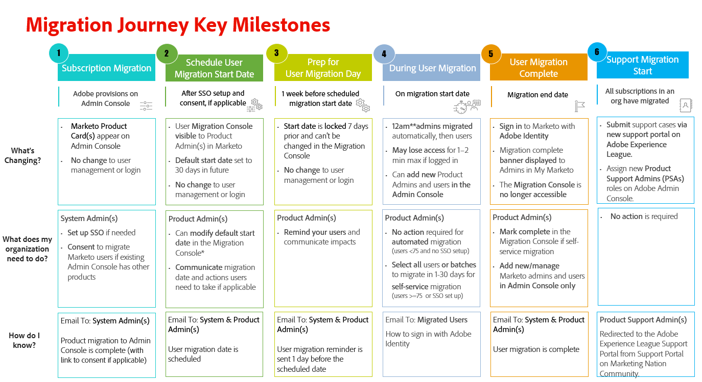

# Noções básicas sobre assinatura do Marketo e migração de usuários para o Adobe Admin Console {#understanding-marketo-subscription-and-user-migration-to-the-adobe-admin-console}

A Adobe está aprimorando o modo como você gerencia as assinaturas e os usuários da Adobe Marketo Engage, aumentando a produtividade para você e para a sua organização. Como parte dessa alteração, a Adobe está migrando suas assinaturas e usuários do Marketo Engage para a Adobe Admin Console. Essa é uma migração necessária e não afetará nenhum fluxo de trabalho de marketing, conteúdo, integrações ou ativos.

>[!TIP]
>
>Saiba como você pode usar o Adobe Admin Console para gerenciar seus direitos da Adobe em toda a organização com o [Guia de Administração de Empresas e Equipes](https://helpx.adobe.com/br/enterprise/admin-guide.html){target="_blank"}.

## O que está mudando? {#what-is-changing}

Como parte da migração, sua assinatura e o gerenciamento de usuários passarão do aplicativo do Marketo para o Adobe Admin Console.

* **Os administradores do sistema gerenciarão assinaturas no Adobe Admin Console**. Veja todos os seus produtos Adobe em um único console.

* **Os Administradores de Produtos gerenciarão os usuários e seus acessos no Adobe Admin Console**. Adicione e remova usuários para todas as suas assinaturas do Adobe. A Adobe Admin Console não oferece suporte à expiração de acesso com base no usuário. Os usuários que têm acesso ao Marketo Engage programado para expirar após a migração ainda serão migrados e receberão acesso sem expiração. Após a migração, eles devem ser removidos manualmente na (ou antes da) data de expiração desejada.

* **Os usuários entrarão com a Adobe Identity**. O Adobe migrará os usuários existentes para o Adobe Admin Console. Os usuários farão logon em suas assinaturas do Marketo usando sua nova Identidade da Adobe - uma Adobe ID ou Adobe Federated ID (SSO).

* **As URLs serão diferentes após a migração**. O Marketo Engage deixará de ser distribuído do experience.adobe.com para o Adobe Experience Cloud e as URLs estarão no seguinte formato: `https://experience.adobe.com/#/@tenantID/so:XXX-XXX-XXX/marketo-engage/classic/` (os XXXs representam a Munchkin ID e o @tenantID é da sua organização Adobe). Incluir na lista de permissões Você precisará trabalhar com sua equipe de TI para classificar todos os domínios do Adobe listados [na parte superior deste artigo](/help/marketo/getting-started/initial-setup/configure-protocols-for-marketo.md){target="_blank"} para evitar a interrupção do acesso ao Marketo Engage.

Os números de ID dos seus ativos permanecem inalterados. Além disso, os links e marcadores anteriores para ativos do Marketo Engage no domínio engage-xx.marketo.com _continuarão a funcionar._ No entanto, primeiro faça logon na instância do Marketo Engage para o URL para o qual você está navegando. Por exemplo, para navegar até um marcador de uma Campanha inteligente na instância com a Munchkin ID 123-ABC-456, primeiro é necessário fazer logon na instância do Marketo Engage com a Munchkin ID 123-ABC-456.

Embora não seja planejado, o trabalho de desenvolvimento futuro pode interromper essa função de redirecionamento. Para evitar interrupções inesperadas, é recomendável atualizar os marcadores assim que possível.

## O que não está mudando? {#what-is-not-changing}

* **Não há alteração na forma como você gerencia todas as outras funcionalidades** no próprio aplicativo do Marketo Engage, incluindo o gerenciamento de recursos, funções de usuário, espaços de trabalho, funcionalidade e comportamento. O gerenciamento de usuários local (somente API) permanece na guia _Usuários e funções_ da área de administração do Marketo.

## Cronograma da Jornada de migração {#migration-journey-timeline}

Primeiro, o Adobe migrará suas assinaturas do Marketo Engage para o Adobe Admin Console e, em seguida, migrará todos os usuários existentes com endereços de email verificados. Se você for um Administrador do sistema ou um Administrador de produto do Marketo, receberá emails orientando sobre a jornada de migração. Esta é uma linha do tempo do que você pode esperar:

{width="800" zoomable="yes"}

### Migração de assinatura concluída {#subscription-migration-complete}

Os administradores do sistema receberão um email quando a migração da assinatura para o Adobe Admin Console for concluída.

Os administradores de sistema podem precisar concluir algumas etapas necessárias antes de começar a migração do usuário para minimizar o impacto para os usuários do Marketo:

* Se seus usuários do Marketo atualmente fizerem logon com SSO, você precisará configurar o SSO no Adobe Admin Console para que seus usuários possam continuar a fazer logon com SSO. Se os usuários do Marketo não utilizarem o SSO no momento, mas você quiser configurá-lo no Adobe Admin Console, faça isso neste momento da jornada de migração.

* Se você já gerencia outros produtos da Adobe em sua Adobe Admin Console, a Adobe pode solicitar seu consentimento para migrar automaticamente os usuários para o console existente. Clique no botão &quot;Introdução&quot; no email para navegar até a página de consentimento.

Não há alterações no gerenciamento de usuários no momento. Embora os produtos da Marketo sejam exibidos no Admin Console, os administradores do Marketo continuarão a gerenciar usuários na área de administração do Marketo e os usuários continuarão a fazer logon com sua identidade da Marketo até que a migração de usuários seja concluída. Durante esse período, os produtos da Marketo não podem ser administrados no Admin Console até que a migração do usuário comece. Isso inclui a instância do Dynamic Chat associada à assinatura.

>[!NOTE]
>
>Se você não usa SSO atualmente, mas está pensando em implementá-lo, sugerimos fazê-lo antes que a migração de usuário ocorra. Se você quiser implementar o Logon único e sua assinatura tiver sido integrada à Adobe Identity sem o SSO implementado na Organização da Adobe, envie um tíquete para o [Suporte da Marketo](https://nation.marketo.com/){target="_blank"} e especifique o tópico como &quot;Marketo no Admin Console, implementando o SSO&quot;.

### Agendar migração de usuário {#schedule-user-migration}

Depois que o administrador do sistema concluir os pré-requisitos descritos na seção anterior, a Adobe agendará automaticamente sua migração de usuário com 30 dias de antecedência e se comunicará com os administradores de produto do Marketo para gerenciar a migração de usuário.

Os administradores de produto do Marketo irão:

* Receba um e-mail com a data agendada de início da migração de usuário com 30 dias de antecedência.

* Obtenha acesso ao Console de migração do Marketo, localizado na área de Administração do Marketo, onde eles têm a opção de alterar a data de migração de uma assinatura.

>[!NOTE]
>
>Devido à complexidade da migração, as alterações de data são restritas a não mais de 30 dias além da data agendada. Envie um email para `marketocares@marketo.com` se precisar de uma data posterior.

* Consulte um banner em Meu Marketo exibindo uma contagem regressiva para a Data de início da migração do usuário.

* Receba um email de lembrete um dia antes da Data de início da migração do usuário.

### Dia de Preparação de Usuários para Migração {#prepare-users-for-migration-day}

Como administrador de produto do Marketo, é recomendável garantir que todos os usuários estejam preparados para o dia da migração.

* Verifique o status de [verificação de email](/help/marketo/product-docs/administration/users-and-roles/email-verification.md){target="_blank"} para todos os usuários na área de Administração do Marketo. Incentive os usuários que não verificaram seus endereços de email a fazê-lo e ajude-os a resolver quaisquer desafios na conclusão do processo de verificação.

* Procure na sua caixa de entrada de e-mails as notificações de usuário &quot;bloqueadas&quot;. Aconselhe os usuários que foram bloqueados a redefinir sua senha para restabelecer o acesso ao Marketo Engage antes do dia da migração.

* Prepare todos os usuários para a migração futura para o Adobe Identity.

>[!IMPORTANT]
>
>Se um usuário do Marketo Engage não verificar seu endereço de email ou for bloqueado no momento da migração do usuário, ele não será migrado para uma Adobe ID e perderá o acesso à assinatura do Marketo após a conclusão da migração da assinatura. Para recuperar o acesso, um administrador de produto do Marketo precisaria adicioná-los como um novo usuário.

### O que esperar no dia da migração {#what-to-expect-on-migration-day}

Todas as assinaturas do Marketo com fuso horário dos EUA serão migradas a partir da meia-noite, hora padrão do Pacífico, da data de início da migração. A migração de usuário para todas as outras assinaturas começará à meia-noite do fuso horário especificado da assinatura.

**O Adobe migrará automaticamente os Administradores do Marketo (com uma função de Administrador padrão) primeiro**. Quando os administradores do Marketo migrarem para a Adobe Identity com uma função de administrador de produto do Admin Console, eles receberão a função de administrador de produto do Adobe no aplicativo do Marketo, juntamente com quaisquer outras funções que tenham tido anteriormente.

**Se a sua assinatura do Marketo não tiver SSO na Marketo e/ou na sua Organização Adobe**, a Adobe migrará automaticamente o restante dos usuários. Esse fluxo de trabalho tem como objetivo fornecer o mais alto nível de automação para minimizar a sobrecarga dos usuários do Adobe Marketo. Nenhuma ação da sua parte é necessária para executar a migração.

**Se sua assinatura do Marketo tiver SSO no Marketo e/ou na sua Organização Adobe**, os Administradores do Marketo terão acesso à área Migração de Usuário de Autoatendimento do Console de Migração do Marketo, localizada na Área de Administração do Marketo. Para aqueles que precisam de maior controle durante o processo de migração de usuário, os administradores do Marketo poderão começar a selecionar usuários para migrar em lotes ou todos de uma só vez. Depois que os usuários são selecionados, os administradores têm a opção de &quot;Migrar agora&quot; ou &quot;Agendar migração&quot; para uma data posterior, proporcionando aos administradores o máximo de flexibilidade e controle sobre quais usuários são migrados quando.

>[!NOTE]
>
>Não haverá perda de acesso ao produto durante a migração do usuário. Se um usuário estiver conectado durante o tempo em que for migrado, ele será desconectado e solicitado a fazer logon novamente em minutos usando a Adobe Identity após a conclusão da migração. O usuário deve aceitar o convite clicando no link do email de direito enviado ao final de uma migração de usuário bem-sucedida.

À medida que os usuários são migrados, eles receberão um email do Adobe notificando-os sobre a alteração na maneira como fazem logon no Marketo. Os usuários **devem** aceitar um convite para entrar usando a Identidade da Adobe pela primeira vez, seja entrando com uma Adobe ID existente ou configurando uma nova Adobe ID usando o mesmo endereço de email.

Mais informações podem ser encontradas em [Migração para a Adobe Identity](/help/marketo/product-docs/administration/marketo-with-adobe-identity/subscription-and-user-migration/migrating-to-adobe-identity.md){target="_blank"}, [Entrar Usuário com o Adobe](/help/marketo/product-docs/administration/marketo-with-adobe-identity/user-sign-in-with-adobe-id.md){target="_blank"} e [Perguntas frequentes sobre o Adobe Identity Management](/help/marketo/product-docs/administration/marketo-with-adobe-identity/faq.md){target="_blank"}.

## Migração de usuário concluída {#user-migration-complete}

A Adobe notificará todos os administradores do sistema e administradores de produtos por email depois que todos os administradores e usuários forem migrados. No momento, todos os usuários da Marketo para essa assinatura farão logon na Marketo usando a Adobe Identity, e os Administradores de produto gerenciarão os usuários somente no Adobe Admin Console.

## Obter suporte {#get-support}

Para obter suporte adicional sobre sua assinatura ou migração de usuário, envie um email para `marketocares@marketo.com`.

>[!MORELIKETHIS]
>
>* [Visão geral da migração para a Adobe Identity](/help/marketo/product-docs/administration/marketo-with-adobe-identity/subscription-and-user-migration/migrating-to-adobe-identity.md){target="_blank"}
>* [Entrada de usuário com o Adobe](/help/marketo/product-docs/administration/marketo-with-adobe-identity/user-sign-in-with-adobe-id.md){target="_blank"}
>* [Perguntas frequentes sobre o Adobe Identity Management](/help/marketo/product-docs/administration/marketo-with-adobe-identity/faq.md){target="_blank"}
>* [Tutorial de Migração para o Adobe Identity Management](https://experienceleague.adobe.com/en/docs/marketo-learn/tutorials/fundamentals/migrating-to-adobe-identity-management){target="_blank"}
