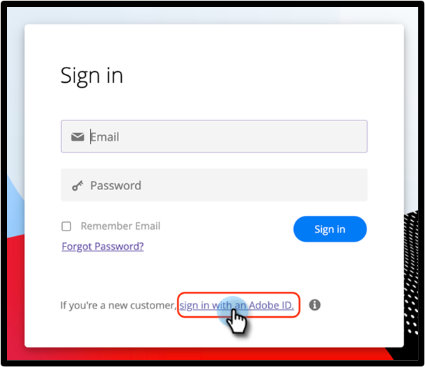

# Logon de usuário com a Adobe ID {#user-sign-in-with-adobe-id}

Quando um usuário com a Adobe Identity precisa fazer logon no aplicativo do Marketo Engage, ele deve fazer logon por meio do link de logon da Adobe ID, em vez do logon típico na página de logon do Marketo Engage. Ao clicar no link, o usuário será direcionado para o Aplicativo do Marketo Engage.

1. Clique em **[!UICONTROL Continuar com AdobeID]** na página de logon do Marketo Engage.

   

1. Insira suas credenciais do Adobe e clique em **[!UICONTROL Continuar]**.

   

Depois de fazer logon, você será direcionado para o aplicativo do Marketo Engage.
