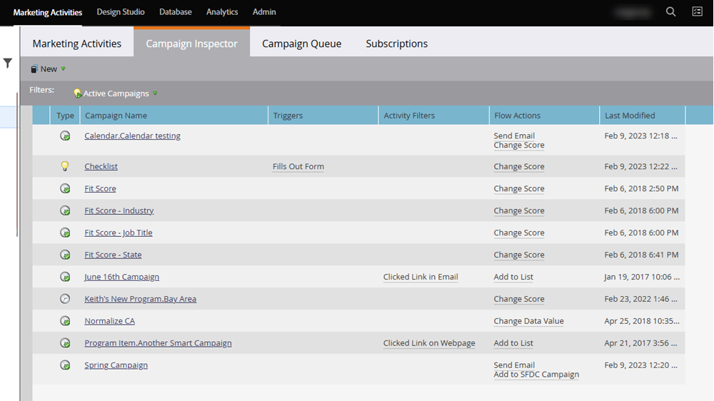

# Inspetor de campanhas {#campaign-inspector}

Use o Inspetor de campanhas para exibir/pesquisar todas as suas Campanhas inteligentes em um único local.

## Ativar o Inspetor de campanha {#enable-campaign-inspector}

1. Vá para a área **[!UICONTROL Administrador]**.

   

1. Clique em **[!UICONTROL Tesouro]**.

   

1. Clique em **[!UICONTROL Editar]** ao lado de Inspetor de campanha.

   

1. Marque a caixa de seleção **[!UICONTROL Habilitado]** e clique em **[!UICONTROL Salvar]**.

   

   >[!NOTE]
   >
   >O espaço de trabalho desejado precisa ser selecionado na árvore para ver a guia Inspetor de campanha depois que ela for ativada.

## Uso do Inspetor de campanha {#using-campaign-inspector}

Depois de habilitada, a guia Inspetor de campanha pode ser encontrada ao lado da guia Atividades de marketing.

Clique no menu suspenso **[!UICONTROL Campanhas ativas]** para filtrar por diferentes tipos de campanhas.

Na parte inferior da página, acesse ferramentas úteis como a barra de pesquisa ou exporte os resultados.

