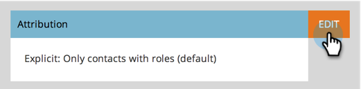

# Alterar configurações de atribuição do Analytics {#change-attribution-settings-for-analytics}

Você pode alterar a maneira como a Marketo vincula contatos a oportunidades para atribuição de primeiro e de vários contatos, métricas de conversão de clientes potenciais e o sinalizador de oportunidade influenciada por marketing.

1. Vá para a área **[!UICONTROL Administrador]**.

   

1. Clique em **[!UICONTROL Análise do ciclo de receita]**.

   

1. Clique no link **[!UICONTROL Editar]** em **[!UICONTROL Atribuição]**.

   

   >[!TIP]
   >
   >A alteração dessa configuração não modifica nenhum dado do Marketo; ela altera a forma como seus relatórios são executados. Isso pode ser revertido a qualquer momento.

1. Selecione uma opção e clique em **[!UICONTROL Salvar]**.

   

   >[!NOTE]
   >
   >**Definição**
   >
   >**[!UICONTROL Explícito]**: somente contatos com funções (padrão).
   >
   >**[!UICONTROL Híbrido]**: contatos com funções, se disponíveis. Se nenhum estiver disponível, ele usará todos os contatos nas contas.
   >
   >**[!UICONTROL Implícito]**: todos os contatos, independentemente da função.

>[!CAUTION]
>
>Ao usar **[!UICONTROL Implícito]**, o Marketo sempre examinará todos os contatos associados à conta, independentemente da função. A **Marketo recomenda usar o modo [!UICONTROL Explicit]**. Usar [!UICONTROL Implícito] pode criar falsos positivos, ou seja, pessoas com crédito por uma oportunidade, apesar de não terem influência real na oportunidade. Use [!UICONTROL Implícito] com cuidado.
