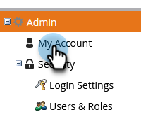

# Alterar Fuso Horário {#change-time-zone}

Saiba como alterar o fuso horário em sua assinatura do Marketo Engage.

1. Vá para a área **[!UICONTROL Administrador]**.

   

1. Selecione **[!UICONTROL Minha conta]**.

   

1. Clique na guia **[!UICONTROL Editar configurações de localização]**.

   

1. Uma modal é exibida. Clique no menu suspenso **[!UICONTROL Fuso horário]** e faça sua seleção.

   

   >[!NOTE]
   >
   >O _Idioma_ e a _localidade_ estão esmaecidos, pois essas configurações devem ser acessadas no seu [perfil de conta da Adobe](https://account.adobe.com/profile){target="_blank"}.

1. Clique em **[!UICONTROL Salvar]**.
