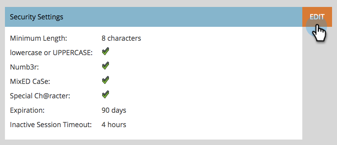

# Alterar configurações de segurança de senha {#change-your-password-security-settings}

Controle a política de senha da sua assinatura. Veja como.

>[!NOTE]
>
>**Permissões de administrador necessárias**

1. Vá para a área **[!UICONTROL Administrador]**.

   

1. Clique em **[!UICONTROL Configurações de logon]**.

   

1. Em **[!UICONTROL Configurações de segurança]**, clique em **[!UICONTROL Editar]**.

   

1. Selecione um **[!UICONTROL Modelo]**. Para opções avançadas, clique no menu suspenso **[!UICONTROL Avançadas]**.

   

   >[!NOTE]
   >
   >Um modelo é apenas uma configuração pré-criada. **[!UICONTROL A Segurança Padrão]** é boa. **[!UICONTROL Alta Segurança]** é a mais forte. **[!UICONTROL Personalizado]** permite que você crie o seu próprio.

   >[!TIP]
   >
   >Em **[!UICONTROL Personalizado]**, marque as caixas para indicar quais características você deseja que os usuários incluam ao criar senhas.

1. Defina a **[!UICONTROL Expiração]**. Esse recurso exige que os usuários redefinam suas senhas automaticamente após um determinado período. Isso também inclui o usuário administrador.

   

   >[!CAUTION]
   >
   >Os usuários existentes não serão notificados sobre as alterações. Defina **[!UICONTROL Expiração]** para 30 dias primeiro para garantir que todos tenham atualizado para as novas configurações e, em seguida, altere novamente para sua cadência original.

1. Defina o **[!UICONTROL Tempo limite de sessão inativa]**. Isso determina por quanto tempo um usuário pode ficar inativo antes de ter que fazer logon novamente no Marketo.

   
