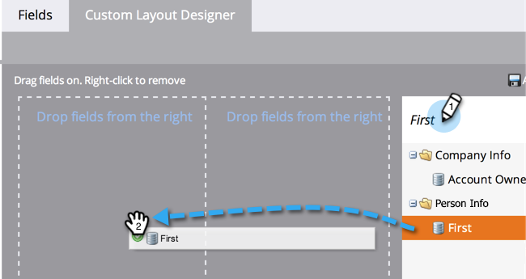
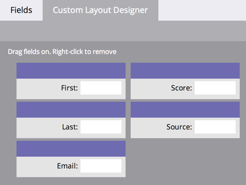

# Criando uma Guia Personalizada para a Página Detalhes da Pessoa {#creating-a-custom-tab-for-the-person-detail-page}

Se você estiver procurando um conjunto específico de campos nos detalhes da pessoa repetidamente, considere criar um layout personalizado para facilitar as coisas.

1. Vá para a área **[!UICONTROL Administrador]**.

   

1. Clique em **[!UICONTROL Gerenciamento de campos]**.

   

1. Clique na guia **[!UICONTROL Designer de layout personalizado]**.

   

1. Localize um campo que deseja adicionar, em seguida, arraste e solte-o na tela.

   

1. Continue adicionando campos até ter o layout como deseja.

   

   >[!NOTE]
   >
   >Você tem duas colunas para trabalhar.

   Se decidir remover um campo, clique com o botão direito do mouse no campo que deseja remover e clique em **[!UICONTROL Excluir]**.

   

   Ótimo trabalho! Agora, ao carregar os detalhes de uma pessoa, você pode usar o layout personalizado para acessar as informações importantes para você.

   
