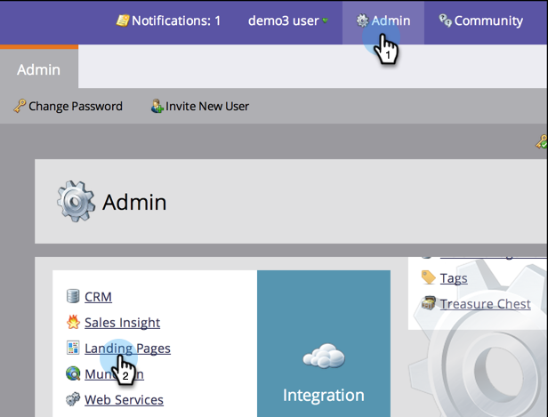

# Personalize seus URLs de Landing page com um CNAME (Administração) {#customize-your-landing-page-urls-with-a-cname-administration}

Embora o Marketo hospede suas landings page, o URL deve ser personalizado para sua empresa.

>[!NOTE]
>
>Sem CNAME:
>
>https://na-sj02.marketo.com/lp/mktodemoaccount126/UnsubscribePage.html
>
>CNAME de marca:
>
>https://go.**YourCompany**.com/UnsuscribePage.html

>[!NOTE]
>
>**Permissões de administrador necessárias**

Vamos te preparar!

1. Escolha um CNAME.

   É a parte principal do URL. Exemplos:

   * **vá**.YourCompany.com/NameOfPage.html
   * **info**.YourCompany.com/NameOfPage.html
   * **páginas**.YourCompany.com/NameOfPage.html

   A única palavra (mais YourCompany.com) é chamada de CNAME. Você precisará disso mais tarde, então anote isso.

1. Localize a sua sequência de caracteres da conta.

1. Vá para a área **Admin** e clique em **Landing page**.

   

1. Na guia **Landing page** , copie a string de conta na seção Configurações.

   

1. Você também precisará disso mais tarde, então anote isso.

1. Envie a solicitação para TI.

1. Solicite à equipe de TI que configure o CNAME a seguir (substitua a palavra [CNAME] e [ACCOUNT STRING] pelo texto da etapa anterior):

   [CNAME].YourCompany.com > STRING [de]CONTA.mktoweb.com

1. Conclua a configuração CNAME.

1. Depois que a TI tiver criado o CNAME, vá para **Admin** e clique em **Landing page**.

   

1. Na seção **Configurações** , clique em **Editar**.

   

1. Insira seu CNAME no nome **do domínio para Landing page**, digite sua página **** de Fallback, digite sua **Página inicial** e clique em **Salvar**.

   

Sua página de fallback é onde as pessoas serão redirecionadas se sua landing page de marketing não estiver disponível.

Bom trabalho! Suas landings page agora têm sua marca de domínio de empresa.
