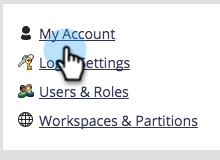

# Editar configurações de conta {#edit-account-settings}

Precisa alterar o endereço de email, o nome ou o número de telefone da conta? Saiba mais abaixo.

>[!NOTE]
>
>**Permissões de administrador necessárias**

1. Vá para a **[!UICONTROL Admin]** área.

   

1. Selecionar **[!UICONTROL Minha conta]**.

   

1. Selecionar **[!UICONTROL Editar configurações da conta]**.

   

1. Faça suas edições e clique em **[!UICONTROL Salvar]**.

   
