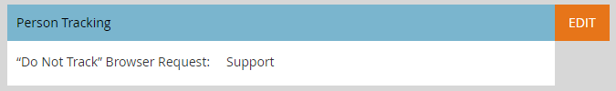

# Editar as configurações de suporte do navegador &quot;Não rastrear&quot; {#edit-do-not-track-browser-support-settings}

>[!NOTE]
>
>**FYI**
>
>O Marketo agora está padronizando o idioma em todas as subscrições, portanto você pode ver o lead/lead na sua subscrição e a pessoa/pessoas em docs.marketo.com. Estes termos significam a mesma coisa. isso não afeta as instruções do artigo. Há outras mudanças também. [Saiba mais](http://docs.marketo.com/display/DOCS/Updates+to+Marketo+Terminology).

&quot;Não rastrear&quot; é uma solicitação de navegador para não ser rastreada em sistemas como o Marketo. Você pode atender a solicitação com as etapas a seguir.

>[!NOTE]
>
>**Permissões de administrador necessárias**

>[!NOTE]
>
>A opção &quot;Não rastrear&quot; será definida como Ignorar por padrão, portanto, se isso for o que você deseja, não será necessário executar nenhuma etapa.

1. Clique em** Admin**.

   

1. Clique em **Munchkin**.

   

1. Em Rastreamento **de** pessoas, clique em **Editar**.

   

1. Selecione **Suporte** e clique em **Salvar**.
1. 

   Depois de salvar as alterações, você verá a atualização.

   

   >[!NOTE]
   >
   >A prática recomendada é suportar o recurso &quot;Não rastrear&quot;. Na Europa, é a lei!

   >[!TIP]
   >
   >Para saber mais sobre &quot;Não rastrear&quot; e como ele funciona, visite [esta página](https://en.wikipedia.org/wiki/Do_Not_Track).

