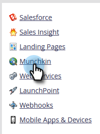

# Editar as configurações de suporte do navegador &quot;Não rastrear&quot; {#edit-do-not-track-browser-support-settings}

&quot;Não rastrear&quot; é uma solicitação de navegador para não ser rastreada em sistemas como o Marketo. Você pode atender a essa solicitação com as etapas a seguir.

>[!NOTE]
>
>**Permissões de administrador necessárias**

>[!NOTE]
>
>&quot;Não rastrear&quot; será definido como Ignorar por padrão, portanto, se isso for o que você deseja, não será necessário executar nenhuma etapa.

1. Clique em **Administrador**.

   

1. Clique em **Munchkin**.

   

1. Em **Rastreamento de pessoa**, clique em **Editar**.

   

1. Selecionar **Suporte** e clique em **Salvar**.

   

   Depois de salvar as alterações, você verá a atualização.

   

   >[!NOTE]
   >
   >A prática recomendada é suportar o recurso &quot;Não rastrear&quot;. Na Europa, é a lei!

   >[!TIP]
   >
   >Para saber mais sobre &quot;Não rastrear&quot; e como ele funciona, visite [esta página](https://en.wikipedia.org/wiki/Do_Not_Track).
