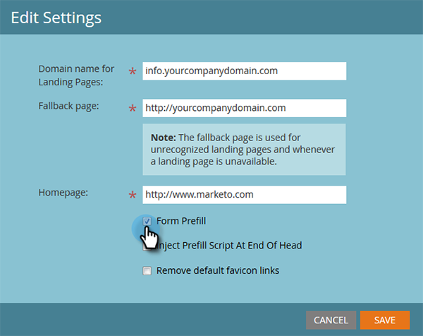

# Editar configurações da página de aterrissagem {#edit-landing-page-settings}

É possível editar o nome de domínio e a página de fallback, habilitar ou desabilitar o preenchimento prévio do formulário, evitar o uso indevido da página de aterrissagem e muito mais. Veja como.

>[!NOTE]
>
>**Permissões de administrador necessárias**

1. Vá para a área **[!UICONTROL Administrador]**.

   

1. Clique em **[!UICONTROL Landing Pages]**.

   

1. Na seção **[!UICONTROL Landing Pages]**, clique em **[!UICONTROL Editar]**.

   

1. Insira as informações de domínio e página.

   

   | Termo | Definição |
   |---|---|
   | [!UICONTROL Nome de domínio das páginas de aterrissagem] | Este é o seu CNAME. Um CNAME é a primeira parte do URL que você fornece às pessoas para landing pages. Por exemplo, em `https://go.yourCompany.com`, a palavra &quot;go&quot; é o CNAME. Você pode ter múltiplos, mas a maioria das pessoas só usa um. |
   | [!UICONTROL Página de fallback] | É aqui que você pode ir se a landing page não existir ou estiver inativa. Saiba mais sobre [páginas de fallback](/help/marketo/product-docs/administration/settings/set-a-fallback-page.md). |
   | [!UICONTROL Página inicial] | Insira o URL do site corporativo. |

1. Marque a caixa de seleção **[!UICONTROL Preenchimento prévio do formulário]** para permitir que os formulários preencham previamente as informações de pessoas conhecidas (com cookies). Desmarque para bloquear.

   

   >[!NOTE]
   >
   >Se quiser que a marca `<script>` de preenchimento prévio apareça no final da marca `<head>` no código, marque a caixa **[!UICONTROL Inserir script de preenchimento prévio no final do cabeçalho]**. Deixe desmarcado se quiser que ele apareça no início.
   >
   >Marque **[!UICONTROL Remover links favicon padrão]** para impedir que o Marketo insira links favicon no código.

1. Depois de fazer suas seleções, clique em **[!UICONTROL Salvar]**.

   

   Excelente trabalho! Suas landing pages agora têm as informações certas e devem começar a funcionar imediatamente.
