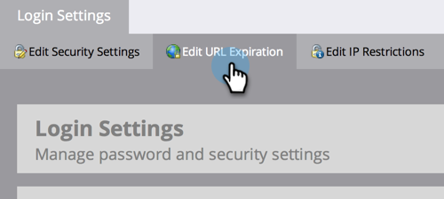

# Editar expiração de link em relatórios e alertas {#edit-link-expiration-in-reports-and-alerts}

Os links nos emails de assinatura de relatório expiram após três dias. Para alterar a hora de expiração desses links, siga estas etapas.

>[!NOTE]
>
>**Permissões de administrador necessárias**

1. Vá para a seção **[!UICONTROL Admin]**.

   

1. Clique em **[!UICONTROL Configurações de logon]**.

   

1. Clique em **[!UICONTROL Editar expiração da URL]**.

   

1. Na lista suspensa, selecione o número de dias antes do link expirar. Clique em **[!UICONTROL Salvar]**.

   

>[!IMPORTANT]
>
>Essa configuração se aplica somente a links em relatórios e alertas. Isso **não** se aplica ao link de email [relatório de download](/help/marketo/product-docs/reporting/basic-reporting/report-subscriptions/subscribe-to-a-smart-list.md#email-message) ou aos emails de marketing.
