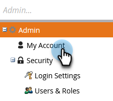

# Editar configurações de assinatura {#edit-subscription-settings}

Se você tiver acesso a várias assinaturas do Marketo e quiser confirmar qual delas está usando, dê a cada uma um nome exclusivo. Esse nome é exibido na parte superior da página de assinatura.

Por exemplo, se você trabalhar em instâncias de produção e de sandbox, poderá nomear uma assinatura **Produção de Marketo** e outra **Sandbox da Marketo**.

1. Vá para **[!UICONTROL Admin]**.

   

1. Clique em **[!UICONTROL Minha conta]**.

   

1. Clique em **[!UICONTROL Editar Informações da Assinatura]**.

   

1. Faça suas edições e clique em **[!UICONTROL Salvar]**.

   
