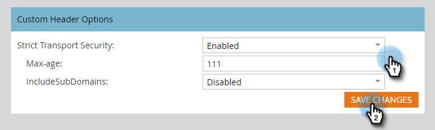

# Cabeçalhos de link de rastreamento de email {#email-tracking-link-headers}

Siga as etapas abaixo para personalizar os cabeçalhos do link de rastreamento de email.

1. No Marketo, clique em **Administrador**.

   

1. Clique em **Email**.

   

1. Role para baixo até Opções de cabeçalho personalizadas. Escolha as configurações desejadas e clique em **Salvar alterações**.

   

<table>
 <tr>
  <td><strong>Strict-Transport-Security</strong></td>
  <td>Use essa opção para garantir que as conexões com as Páginas de aterrissagem sejam sempre veiculadas por HTTPS (só deve ser definido para assinaturas com Páginas de aterrissagem seguras por SSL)</td>
 </tr>
</table>

>[!CAUTION]
>
>É importante analisar essas configurações com a equipe de TI para determinar a política da organização a ser definida. Configurações incorretas podem impedir que alguns visitantes acessem seus links de email.
