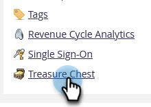

# Ativar ou desativar os recursos do Treasure Chest {#enable-or-disable-treasure-chest-features}

O Treasure Chest possui características experimentais divertidas que não são totalmente suportadas.

>[!NOTE]
>
>**Permissões de administrador necessárias**

1. Vá para a **[!UICONTROL Admin]** área.

   

1. Clique em **[!UICONTROL Tórax Tesouro]**.

   

1. Clique em **[!UICONTROL Editar]** para o recurso que deseja ativar ou desativar.

   

1. Verifique a **[!UICONTROL Ativado]** para ativar ou desmarcar para desativar, e clique em **[!UICONTROL Salvar]**.

   

   >[!TIP]
   >
   >Talvez seja necessário fazer logoff e, em seguida, entrar novamente no Marketo para ver as alterações entrarem em vigor.
