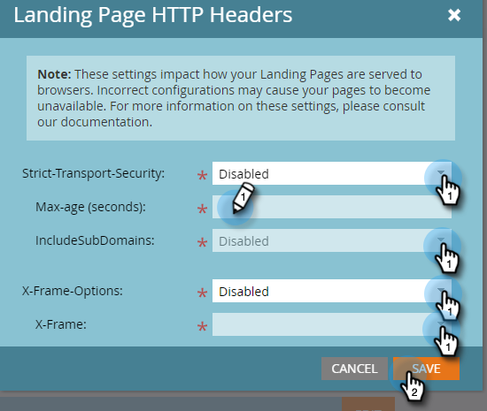

# Cabeçalhos da página de destino {#landing-page-headers}

Siga as etapas abaixo para personalizar alguns dos cabeçalhos HTTP nos domínios da sua página de aterrissagem.

1. No Marketo, clique em **[!UICONTROL Admin]**.

   

1. Clique em **[!UICONTROL Landing Pages]**.

   

1. Clique em **[!UICONTROL Editar]** ao lado de Cabeçalhos HTTP de landing pages.

   

1. Escolha as configurações desejadas e clique em **[!UICONTROL Salvar]** quando terminar.

   

<table>
 <tr>
  <td><strong>[!UICONTROL Segurança-Transporte-Restrita]</strong></td>
  <td>Use isso para garantir que as conexões com as páginas de aterrissagem sempre sejam fornecidas por HTTPS (só deve ser definido para assinaturas com Páginas de aterrissagem protegidas por SSL)</td>
 </tr>
 <tr>
  <td><strong>[!UICONTROL X-Frame-Options]</strong></td>
  <td>Permite definir se os ativos hospedados pela Marketo Engage podem ou não ser incorporados em páginas externas da Web</td>
 </tr>
</table>

>[!CAUTION]
>
>É importante analisar essas configurações com a equipe de TI para determinar como a política da sua organização deve ser definida. Configurações incorretas podem impedir que alguns visitantes acessem suas Landing Pages.
