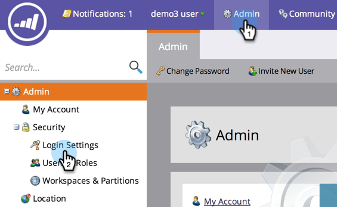

# Restringir logons de marketing com base em IP {#restrict-marketo-logins-based-on-ip}

Você pode restringir ou permitir que os usuários acessem o Marketing com base em seus endereços IP. Veja como.

>[!NOTE]
>
>**Permissões de administrador necessárias**

>[!NOTE]
>
>As informações neste artigo se aplicam somente aos logons diretos em login.marketo.com. Não é possível impor restrições de IP em logons de logon único (SSO) no momento.

1. Em **Admin**, clique em **Definições de Início de Sessão**.

   

1. Clique em **Editar restrições de IP**.

   

1. Escolha se deseja **Permitir **ou **Bloquear** endereços específicos, insira os endereços e clique em **Salvar**.

   >[!NOTE]
   >
   >**Definição**
   >
   >    
   >    
   >    * **Endereços** IP permitidos: A adição de endereços IP permitidos é inclusiva. Ela incluirá todos os endereços IP especificados e excluirá todos os outros.
   >    * **Bloquear endereços** IP: Impede que IPs específicos acessem o Marketo.
   >    * **Desativar restrições** de IP: Marcar essa opção impedirá o funcionamento de todas as regras de restrição. Use-o para fins de teste.

   >[!NOTE]
   >
   >
   >Você pode adicionar várias restrições, mas elas só podem ser TODAS permitidas ou TODAS bloqueadas. Não é possível misturar e combinar permitido e bloqueado.

   

   Muito bem feito, seus dados de marketing agora são mais seguros do que nunca!

