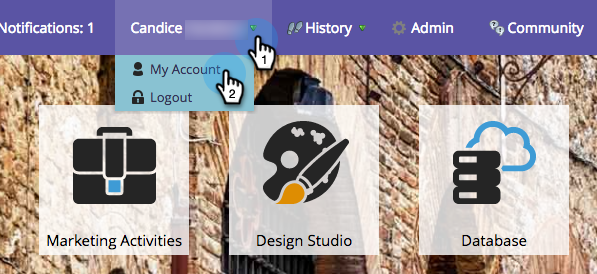

# Selecione seu idioma, localidade e fuso horário {#select-your-language-locale-and-time-zone}

Inglês não é sua primeira língua? Não se preocupe, nós estamos cobertos. Veja como mudar seu próprio idioma, localidade e fuso horário.

## Idiomas suportados {#supported-languages}

* Inglês
* Francês
* Alemão
* Japonês
* Português
* Espanhol

## Alterar o idioma do usuário, a localidade e o fuso horário {#change-user-language-locale-and-time-zone}

1. Faça logon no Marketo e, em seu nome, selecione **Minha conta**.

   

1. Em Minha conta, clique em **Editar configurações de localização**.

   

1. Altere seu **Idioma**.

   

   >[!TIP]
   >
   >Você também tem a opção de alterar apenas seu idioma clicando no menu suspenso do idioma na parte superior da página de logon.

1. Altere **Locale**.

   

1. Altere seu **Fuso Horário**.

   

1. Clique em **Salvar**.

   

Bom trabalho! Seu navegador será atualizado e você deverá ver as alterações refletidas.

