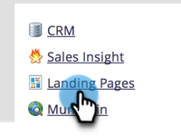

# Definir uma página de fallback {#set-a-fallback-page}

As páginas substitutas são a última linha de defesa se a landing page estiver offline ou não for encontrada. Certifique-se de ter um.

>[!NOTE]
>
>**Permissões de administrador necessárias**

1. Vá para a **[!UICONTROL Admin]** área.

   

1. Clique em **[!UICONTROL Landing Pages]**.

   

1. No **[!UICONTROL Landing Pages]** clique em **[!UICONTROL Editar]**.

   

1. Insira um **[!UICONTROL Página de fallback]** na caixa de diálogo e clique em **[!UICONTROL Salvar]**.

   

