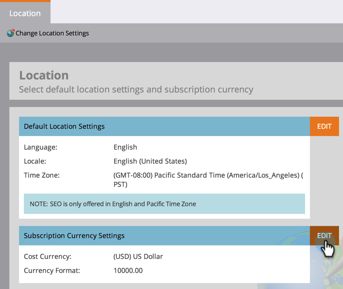

# Definir a moeda padrão {#set-default-currency}

Saiba como exibir e editar a moeda padrão da sua assinatura do Marketo Engage.

>[!NOTE]
>
>**Permissões de administrador necessárias.**

1. Vá para a área **[!UICONTROL Administrador]**.

   

1. Clique em **[!UICONTROL Local]**.

   

1. Clique em **[!UICONTROL Editar]** em [!UICONTROL Configurações de Moeda da Assinatura].

   

1. Selecione o formato de moeda de sua escolha e clique em **[!UICONTROL Salvar]**.

   
