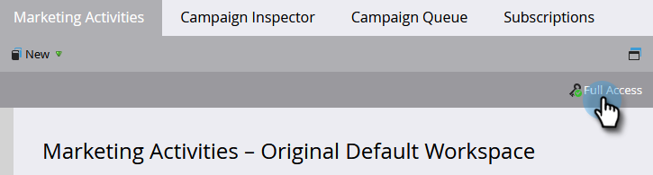

# Descubra Quais Permissões Você Tem {#find-out-what-permissions-you-have}

Se você está se perguntando quais permissões tem ou não no Marketo, há uma maneira fácil de descobrir.

1. Ir para **Atividades de marketing**.

   

1. Clique em **Acesso completo** para ver as permissões que você possui.

   

Você verá as permissões listadas.

Se precisar de alguma das permissões ativadas para você, fale com o administrador do Marketo.
